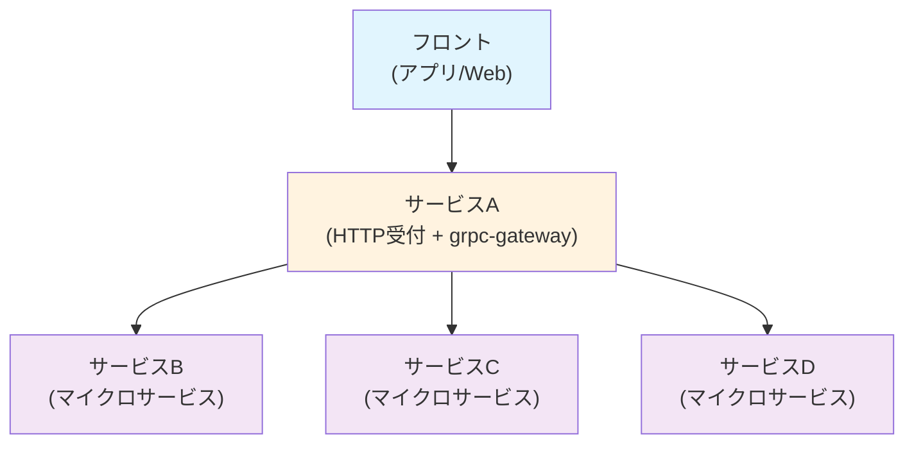

## 特定の API のトレースのみ 100%サンプリングしたい

## aaaa

- トレースの基礎知識がある
- 複数サービスの分散トレーシングに興味がある

## トレースの全体像

### サーバーの構成

ざっくりとした構成は以下のようになっています。

1. フロント（アプリ/Web）からのリクエストは HTTP で受け付ける
1. [grpc-gateway](https://github.com/grpc-ecosystem/grpc-gateway) を用いて、1 の HTTP リクエストを gRPC リクエストに変換し、gPRC サーバーに転送する
1. 複数のマイクロサービスが処理を行う

## サンプリングの種類

##
