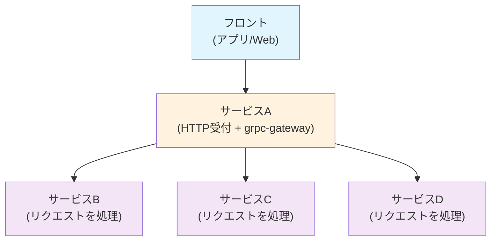
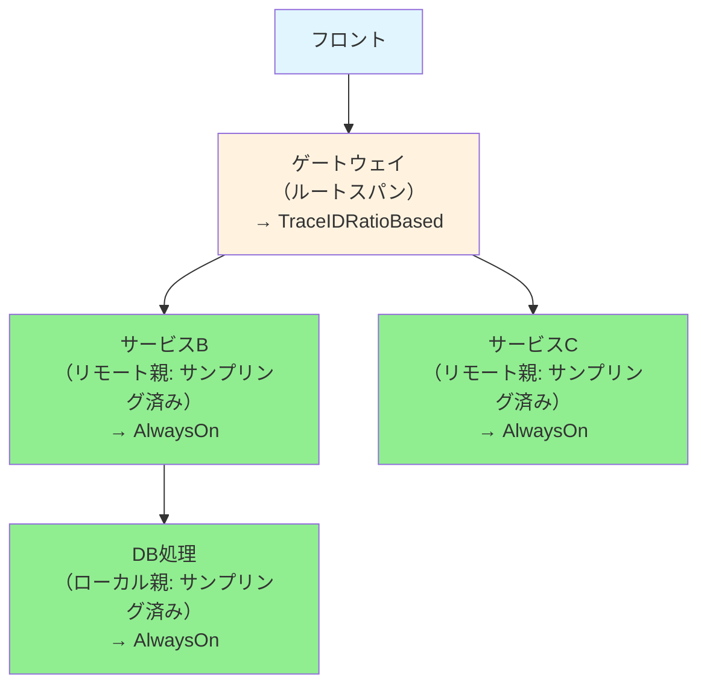

## 特定の API のトレースのみ 100%サンプリングしたい！

こんにちは！株式会社カナリーのマーケットプレイスの事業領域でテクニカルリードエンジニアをしている Pana です。

## 想定される読者

- 複数サービスの分散トレーシングに興味がある
- トレースやスパンの基礎知識がある
- OpenTelemetry の SDK を用いて自前でサンプリングのロジックを実装したい

:::message
今回は SDK レベルで設定できるサンプリングの設定と実装例のみを紹介します。サンプリングの種類によるパフォーマンスの違いなどは説明しません。
:::

## サーバーの構成

弊社では複数のマイクロサービスがバックエンドのサーバーとして動いています。

マイクロサービスがフロントエンドからのリクエストを処理する流れは以下のようになっています。

1. フロント（アプリ/Web）からのリクエストは HTTP で受け付ける
1. [grpc-gateway](https://github.com/grpc-ecosystem/grpc-gateway) を用いて、1 の HTTP リクエストを gRPC リクエストに変換し、対象のサービスの gPRC サーバーにリクエストを送る
1. 2 で処理を受け付けた複数のマイクロサービスがリクエストを処理



"gateway" 的なサービスがフロントからのリクエストを受け付け、それを gPRC に変換して後続のマイクロサービスにリクエストを送って処理する、という流れになっています。

## SDK におけるサンプリングの実装

まずはサンプリングの責務を担っている関数や型などを見ていきます。

下記より詳細な説明に関しては [Tracing SDK#Sampler](https://opentelemetry.io/docs/specs/otel/trace/sdk/#sampler) を見ていただくと良いと思います！

### サンプリングを行うインターフェイス `Sampler`

サンプリングは `Sampler` インターフェイスの `ShouldSample` というメソッドによって行われます。

```go
type Sampler interface {
		// サンプリングを行うかどうかを決めるメソッド
        ShouldSample(parameters SamplingParameters) SamplingResult
        Description() string // 補足説明を表示するメソッド、デバッグなどで用いる
}
```

`SamplingParameters` という引数を渡して、`SamplingResult` を返すというシンプルな実装となっています！

### サンプリングを行うかどうかの情報 `SamplingParameters`

`SamplingParameters` の定義は下記のようになっています。

```go
type SamplingParameters struct {
        ParentContext context.Context
        TraceID       trace.TraceID
        Name          string
        Kind          trace.SpanKind
        Attributes    []attribute.KeyValue
        Links         []trace.Link
}
```

親スパンの Context である `ParentContext` や スパンに付与する Key-Value ペアである`Attributes` などを保持しています。

これらの情報を用いて、サンプリングするべきかどうかを決定すれば良いということになります！

### サンプリングするかどうかの結果を返す `SamplingResult`

`SamplingParameters` の情報を用いて、サンプリングするかどうかを決定した後、その結果は `SamplingResult` として返されます。

```go
type SamplingResult struct {
        Decision   SamplingDecision
        Attributes []attribute.KeyValue
        Tracestate trace.TraceState
}
```

`Decision` フィールドの型である `SamplingDecision` は以下の 3 つのいずれかになります。基本的には `Drop` か `RecordAndSample` を指定することが多いのかなと思います。

```go
const (
	Drop SamplingDecision = iota
	RecordOnly
	RecordAndSample
)
```

また `Tracestate` フィールドは、`SamplingParameters` の `ParentContext` フィールドを用いて以下のように指定することが多いようです。

```go
	SamplingResult{
		// 他のフィールドは省略
		Tracestate: trace.SpanContextFromContext(p.ParentContext).TraceState(),
	}
```

[Treacing SDK#Should Sample](https://opentelemetry.io/docs/specs/otel/trace/sdk/#shouldsample) にも下記にある通りの実装になっています！

> A `Tracestate` that will be associated with the `Span` ... (中略) so samplers SHOULD normally return the passed-in `Tracestate` if they do not intend to change it.

## `ShouldSample` メソッドはどのタイミングで呼ばれるのか？

何がサンプリングするかどうかを決めるかはある程度分かってきたので、次はどのタイミングで `ShouldSample` が呼ばれるのか、を説明しておきたいと思います！

この疑問に対する回答は [Tracing SDK#SDK Span creation](https://opentelemetry.io/docs/specs/otel/trace/sdk/#sdk-span-creation) に以下のような記載があります（一部省略しています）。

1. 親のトレース ID が有効なれば、それを用いる。そうでなければトレース ID を生成する
1. `ShouldSample` メソッドを呼ぶ
1. サンプリングの結果に関係なくスパン ID を生成する
1. 2 の結果によってスパンを生成する

個人的には、上記の順番で生成されるということより、 **スパンを生成するたびに `ShouldSample` メソッドが呼ばれるということが重要** だと思います。

つまり、A -> B -> C のような親子関係でスパンが生成された時、B をサンプリングしたから A や C が **自動的にサンプリングされるわけではない** ということになります！

## サンプリングの種類

ここまでの説明で、なんとなくこういう感じで実装すれば良いのだなというイメージが湧いてきたと思います！💡

さらに SDK に用意されているサンプリングの種類についても説明しておきます！

実際に特定の API のサンプリングを実施する/しないは下記に紹介するいくつかのサンプリングの種類を組み合わせて実装することが多いかと思います。

### [`AlwaysOn`](https://opentelemetry.io/docs/specs/otel/trace/sdk/#alwayson)

全てのトレースをサンプリングする最もシンプルな方法です。SDK に `AlwaysSample` 関数が実装されているので、その関数を使用すれば実装可能です。

```bash
❯ go doc go.opentelemetry.io/otel/sdk/trace.AlwaysSample
package trace // import "go.opentelemetry.io/otel/sdk/trace"

func AlwaysSample() Sampler
    AlwaysSample returns a Sampler that samples every trace. Be careful about
    using this sampler in a production application with significant traffic:
    a new trace will be started and exported for every request.
```

`ShouldSample` の具体的な実装は以下のようになっています。

```go
func (as alwaysOnSampler) ShouldSample(p SamplingParameters) SamplingResult {
	return SamplingResult{
		Decision:   RecordAndSample,
		Tracestate: trace.SpanContextFromContext(p.ParentContext).TraceState(),
	}
}
```

当たり前ですが、`Decision` フィールドに `RecordAndSample` が指定されてます。

### [`AlwaysOff`](https://opentelemetry.io/docs/specs/otel/trace/sdk/#alwaysoff)

全てのトレースを破棄する最もシンプルな方法です。SDK に `NeverSample` 関数が実装されているので、その関数を使用すれば実装可能です。

```bash
❯ go doc go.opentelemetry.io/otel/sdk/trace.NeverSample
package trace // import "go.opentelemetry.io/otel/sdk/trace"

func NeverSample() Sampler
    NeverSample returns a Sampler that samples no traces.
```

`ShouldSample` の具体的な実装は以下のようになっています。

```go
func (ns alwaysOffSampler) ShouldSample(p SamplingParameters) SamplingResult {
	return SamplingResult{
		Decision:   Drop,
		Tracestate: trace.SpanContextFromContext(p.ParentContext).TraceState(),
	}
}
```

こちらも当たり前ですが、`Decision` フィールドに `Drop` が指定されてます。

### [`TraceIdRatioBased`](https://opentelemetry.io/docs/specs/otel/trace/sdk/#traceidratiobased)

トレース ID に基づいて確率的にサンプリングを行う方法です。SDK に `TraceIDRatioBased` 関数が実装されているので、その関数を使用すれば実装可能です。

```bash
❯ go doc go.opentelemetry.io/otel/sdk/trace.TraceIDRatioBased
package trace // import "go.opentelemetry.io/otel/sdk/trace"

func TraceIDRatioBased(fraction float64) Sampler
    TraceIDRatioBased returns a Sampler that samples a given fraction of
    traces. Fractions >= 1 will always sample. Fractions < 0 are treated as
    zero. To respect the parent trace's `SampledFlag`, the `TraceIDRatioBased`
    sampler should be used as a delegate of a `ParentBased` sampler.
```

`1` 以上を指定すると `AlwaysOn` と同じ実装になり、`0` より小さい値を設定すると `AlwaysOff` を同じ挙動になるようです。

また「To respect the parent trace's `SampledFlag`, the `TraceIDRatioBased` sampler should be used as a delegate of a `ParentBased` sampler.」とあるように、親トレースの `SampledFlag` を正しく子に伝搬させるには `ParentBased` サンプラーと組み合わせて使用する必要があります。

`ShouldSample` の具体的な実装は以下のようになっています。

```go
func (ts traceIDRatioBased) ShouldSample(p SamplingParameters) SamplingResult {
	psc := trace.SpanContextFromContext(p.ParentContext)
	x := binary.BigEndian.Uint64(p.TraceID[8:16]) >> 1
	if x < ts.threshold {
		return SamplingResult{
			Decision:   RecordAndSample,
			Tracestate: psc.TraceState(),
		}
	}
	return SamplingResult{
		Decision:   Drop,
		Tracestate: psc.TraceState(),
	}
}
```

トレース ID の後半 8 バイトを数値に変換し、引数の `fraction` をもとに計算された閾値（threshold）と比較してサンプリングするかどうかを決定しています。同じトレース ID であれば常に同じ結果になるため、分散システム全体で一貫したサンプリング判定が可能になります！

### [`ParentBased`](https://opentelemetry.io/docs/specs/otel/trace/sdk/#parentbased)

親スパンの存在とサンプリング状態に基づいて、サンプリングを決定する方法です。SDK に `ParentBased` 関数が実装されているので、その関数を使用すれば実装可能です。

```bash
❯ go doc go.opentelemetry.io/otel/sdk/trace.ParentBased
package trace // import "go.opentelemetry.io/otel/sdk/trace"

func ParentBased(root Sampler, samplers ...ParentBasedSamplerOption) Sampler
    ParentBased returns a Sampler that samples based on whether the parent span
    is sampled. If there is no parent span, this sampler will use the root
    sampler to make sampling decisions.
```

`ShouldSample` の具体的な実装は以下のようになっています。

```go
func (pb parentBased) ShouldSample(p SamplingParameters) SamplingResult {
	psc := trace.SpanContextFromContext(p.ParentContext)

	if psc.IsValid() {
		if psc.IsRemote() {
			if psc.IsSampled() {
				// リモートの親がサンプリング済み
				return pb.remoteParentSampled.ShouldSample(p)
			}
			// リモートの親がサンプリングされていない
			return pb.remoteParentNotSampled.ShouldSample(p)
		} else {
			if psc.IsSampled() {
				// ローカルの親がサンプリング済み
				return pb.localParentSampled.ShouldSample(p)
			}
			// ローカルの親がサンプリングされていない
			return pb.localParentNotSampled.ShouldSample(p)
		}
	}

	// 親スパンが存在しない場合（ルートスパン）
	return pb.root.ShouldSample(p)
}
```

親スパンの **存在・リモート/ローカル・サンプリング状態** の組み合わせによって、5 つの異なるサンプラーを使い分けます。これにより分散トレーシング環境でのトレース全体の一貫性を保つことができます。デフォルトでは、サンプリング済みの親を持つ子スパンは `AlwaysOn`、サンプリングされていない親を持つ子スパンは `AlwaysOff` が適用されます。

### より詳細を深ぼってみる

少々複雑なので、もう少し丁寧に解説してみたいと思います。

#### ParentBased の 5 つのサンプラーの使い分け

ParentBased サンプラーは、親スパンの状況に応じて以下の 5 つのケースを判定し、それぞれ異なるサンプラーを使用します。

**1. 親スパンが存在しない場合（ルートスパン）**

```go
// 親スパンが存在しない → rootサンプラーを使用
if !psc.IsValid() {
    return pb.root.ShouldSample(p)
}
```

- **使用サンプラー**: `root`（通常は `TraceIDRatioBased` を指定）
- **実際の例**: フロントエンドからの最初の HTTP リクエスト
- **動作**: 新しいトレースの開始点として、指定したサンプリング率で判定

**2. リモートの親がサンプリング済みの場合**

```go
// 他のサービスから受信したトレースでサンプリング済み
if psc.IsRemote() && psc.IsSampled() {
    return pb.remoteParentSampled.ShouldSample(p)
}
```

- **使用サンプラー**: `remoteParentSampled`（デフォルト: `AlwaysOn`）
- **実際の例**: サービス A からサービス B への gRPC リクエスト（親はサンプリング済み）
- **動作**: 親がサンプリング済みなので、子も確実にサンプリング

**3. リモートの親がサンプリングされていない場合**

```go
// 他のサービスから受信したトレースで未サンプリング
if psc.IsRemote() && !psc.IsSampled() {
    return pb.remoteParentNotSampled.ShouldSample(p)
}
```

- **使用サンプラー**: `remoteParentNotSampled`（デフォルト: `AlwaysOff`）
- **実際の例**: サービス A からサービス B への gRPC リクエスト（親は破棄済み）
- **動作**: 親が破棄されているので、子も破棄してリソース節約

**4. ローカルの親がサンプリング済みの場合**

```go
// 同一プロセス内の親スパンでサンプリング済み
if !psc.IsRemote() && psc.IsSampled() {
    return pb.localParentSampled.ShouldSample(p)
}
```

- **使用サンプラー**: `localParentSampled`（デフォルト: `AlwaysOn`）
- **実際の例**: 同一サービス内でのデータベースアクセススパン
- **動作**: 同一プロセス内でも親の決定を継承

**5. ローカルの親がサンプリングされていない場合**

```go
// 同一プロセス内の親スパンで未サンプリング
if !psc.IsRemote() && !psc.IsSampled() {
    return pb.localParentNotSampled.ShouldSample(p)
}
```

- **使用サンプラー**: `localParentNotSampled`（デフォルト: `AlwaysOff`）
- **実際の例**: 破棄されたトレース内でのローカル処理
- **動作**: 親が破棄されているので、子も破棄

#### 実際のマイクロサービス環境での流れ



このような仕組みにより、**トレース全体で一貫したサンプリング決定**が保たれ、不完全なトレースの発生を防ぐことができます。

## 一旦まとめてみる

### 疑問 1. AlwaysOn で良いのでは？

「シンプルに `AlwaysOn` で全てのトレースを収集すれば良いのでは？」という疑問について。

開発環境では `AlwaysOn` でも問題ありませんが、本番環境では以下の課題があります：

#### **コストとパフォーマンスの問題**

```go
// 例: 1日100万リクエストのサービス
// AlwaysOn → 100万トレース/日
// TraceIDRatioBased(0.1) → 10万トレース/日（90%削減）
```

- **ストレージコスト**: トレースデータは 1 件あたり数 KB〜MB
- **CPU/メモリ消費**: `span.IsRecording()` が常に true で属性収集処理が毎回実行
- **分析ツール負荷**: 大量データによるダッシュボード・クエリの遅延

**結論**: 本番環境のスケールでは適切なサンプリング戦略が必要です。

### 疑問 2. TraceIdBased は ParentBased と組み合わせる必要がないのでは？

「TraceID が同じなら必ず同じ結果になるから、全サービスで `TraceIDRatioBased` 単独使用で良いのでは？」という疑問について。

理論的には可能ですが、実際の分散システムでは以下の問題があります：

#### **サービス間設定の不統一**

```go
samplerA := trace.TraceIDRatioBased(0.1)  // ゲートウェイ: 10%
samplerB := trace.TraceIDRatioBased(0.05) // 認証: 5%（負荷高）
samplerC := trace.TraceIDRatioBased(0.2)  // 決済: 20%（重要）

// 同じTraceIDでも異なる結果になる可能性
// A: Sample → B: Drop → C: Sample (トレースが断片化)
```

#### **運用上の課題**

- **設定管理**: 全サービスで個別設定が必要（設定漏れリスク）
- **設定変更**: 全サービス同期変更が必要（変更時の不整合リスク）
- **計算効率**: 子スパンでも毎回 TraceID 計算が必要

#### **ParentBased 組み合わせの利点**

```go
// ゲートウェイ（ルート）でのみ判定、他は継承
rootSampler := trace.TraceIDRatioBased(0.1)
sampler := trace.ParentBased(rootSampler)

// 利点:
// - トレース全体の一貫性保証
// - 設定管理の簡素化（ゲートウェイのみ）
// - CPU効率化（子スパンは計算スキップ）
```

**結論**: 決定論的特性は強力ですが、**設定統一性と運用性を考慮すると ParentBased との組み合わせが実用的**です。

## 実際に試してみる

grpc-gateway で作成された "gateway" サーバーと

###
