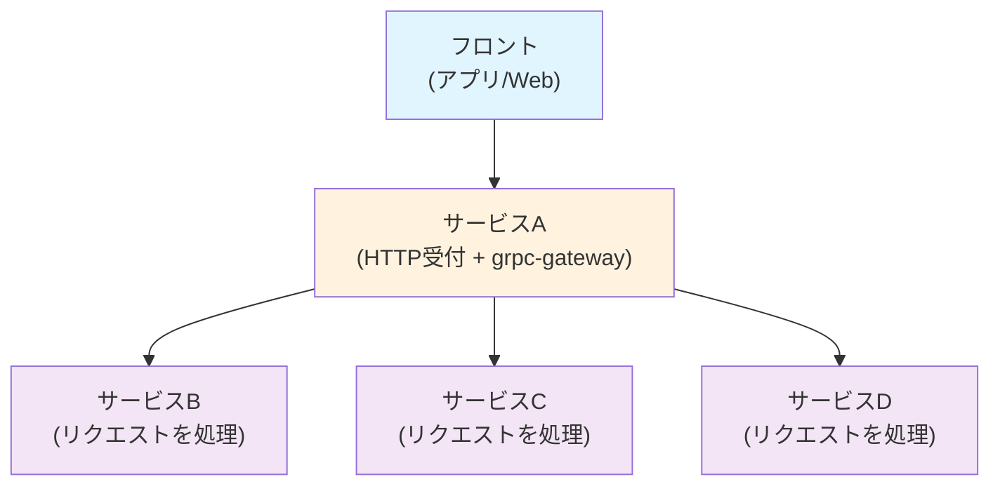

## 特定の API のトレースのみ 100%サンプリングしたい！

こんにちは！株式会社カナリーのマーケットプレイスの事業領域でテクニカルリードエンジニアをしている Pana です。


## 想定される読者

- 複数サービスの分散トレーシングに興味がある
- トレースやスパンの基礎知識がある
- OpenTelemetry の SDK を用いて自前でサンプリングのロジックを実装したい

:::message
今回は SDK レベルで設定できるサンプリングの設定と実装例のみを紹介します。サンプリングの種類によるパフォーマンスの違いなどは説明しません。
:::

## サーバーの構成

弊社では複数のマイクロサービスがバックエンドのサーバーとして動いています。

マイクロサービスがフロントエンドからのリクエストを処理する流れは以下のようになっています。

1. フロント（アプリ/Web）からのリクエストは HTTP で受け付ける
1. [grpc-gateway](https://github.com/grpc-ecosystem/grpc-gateway) を用いて、1 の HTTP リクエストを gRPC リクエストに変換し、対象のサービスの gPRC サーバーにリクエストを送る
1. 2 で処理を受け付けた複数のマイクロサービスがリクエストを処理



"gateway" 的なサービスがフロントからのリクエストを受け付け、それを gPRC に変換して後続のマイクロサービスにリクエストを送って処理する、という流れになっています。

## SDK におけるサンプリングの実装

まずはサンプリングの責務を担っている関数や型などを見ていきます。

下記より詳細な説明に関しては [Tracing SDK#Sampler](https://opentelemetry.io/docs/specs/otel/trace/sdk/#sampler) を見ていただくと良いと思います！

### サンプリングを行うインターフェイス `Sampler`

サンプリングは `Sampler` インターフェイスの `ShouldSample` というメソッドによって行われます。

```go
type Sampler interface {
		// サンプリングを行うかどうかを決めるメソッド
        ShouldSample(parameters SamplingParameters) SamplingResult
        Description() string // 補足説明を表示するメソッド、デバッグなどで用いる
}
```

`SamplingParameters` という引数を渡して、`SamplingResult` を返すというシンプルな実装となっています！

### サンプリングを行うかどうかの情報 `SamplingParameters`

`SamplingParameters` の定義は下記のようになっています。

```go
type SamplingParameters struct {
        ParentContext context.Context
        TraceID       trace.TraceID
        Name          string
        Kind          trace.SpanKind
        Attributes    []attribute.KeyValue
        Links         []trace.Link
}
```

親スパンの Context である `ParentContext` や スパンに付与する Key-Value ペアである`Attributes` などを保持しています。

これらの情報を用いて、サンプリングするべきかどうかを決定すれば良いということになります！

### サンプリングするかどうかの結果を返す `SamplingResult`

`SamplingParameters` の情報を用いて、サンプリングするかどうかを決定した後、その結果は `SamplingResult` として返されます。

```go
type SamplingResult struct {
        Decision   SamplingDecision
        Attributes []attribute.KeyValue
        Tracestate trace.TraceState
}
```

`Decision` フィールドの型である `SamplingDecision` は以下の 3 つのいずれかになります。基本的には `Drop` か `RecordAndSample` を指定することが多いのかなと思います。

```go
const (
	Drop SamplingDecision = iota
	RecordOnly
	RecordAndSample
)
```

また `Tracestate` フィールドは、`SamplingParameters` の `ParentContext` フィールドを用いて以下のように指定することが多いようです。

```go
	SamplingResult{
		// 他のフィールドは省略
		Tracestate: trace.SpanContextFromContext(p.ParentContext).TraceState(),
	}
```

[Treacing SDK#Should Sample](https://opentelemetry.io/docs/specs/otel/trace/sdk/#shouldsample) にも下記にある通りの実装になっています！

> A `Tracestate` that will be associated with the `Span` ... (中略) so samplers SHOULD normally return the passed-in `Tracestate` if they do not intend to change it.

## `ShouldSample` メソッドはどのタイミングで呼ばれるのか？

何がサンプリングするかどうかを決めるかはある程度分かってきたので、次はどのタイミングで `ShouldSample` が呼ばれるのか、を説明しておきたいと思います！

この疑問に対する回答は [Tracing SDK#SDK Span creation](https://opentelemetry.io/docs/specs/otel/trace/sdk/#sdk-span-creation) に以下のような記載があります（一部省略しています）。

1. 親のトレース ID が有効なれば、それを用いる。そうでなければトレース ID を生成する
1. `ShouldSample` メソッドを呼ぶ
1. サンプリングの結果に関係なくスパン ID を生成する
1. 2 の結果によってスパンを生成する

個人的には、上記の順番で生成されるということより、 **スパンを生成するたびに `ShouldSample` メソッドが呼ばれるということが重要** だと思います。

つまり、A -> B -> C のような親子関係でスパンが生成された時、B をサンプリングしたから A や C が **自動的にサンプリングされるわけではない** ということになります！

## サンプリングの種類

ここまでの説明で、なんとなくこういう感じで実装すれば良いのだなというイメージが湧いてきたと思います！💡

さらに SDK に用意されているサンプリングの種類についても説明しておきます！

実際に特定の API のサンプリングを実施する/しないは下記に紹介するいくつかのサンプリングの種類を組み合わせて実装することが多いかと思います。

### [`AlwaysOn`](https://opentelemetry.io/docs/specs/otel/trace/sdk/#alwayson)

全てのトレースをサンプリングする最もシンプルな方法です。 `AlwaysSample` 関数を TraceProvider に渡すことで実装が可能になります。

```bash
❯ go doc go.opentelemetry.io/otel/sdk/trace.AlwaysSample
package trace // import "go.opentelemetry.io/otel/sdk/trace"

func AlwaysSample() Sampler
    AlwaysSample returns a Sampler that samples every trace. Be careful about
    using this sampler in a production application with significant traffic:
    a new trace will be started and exported for every request.
```

**注意点：** 本番環境で大量のトラフィックがある場合、ストレージコストやネットワーク帯域の問題が発生する可能性があります。

### `AlwaysOff`

全てのトレースを破棄するサンプラーです。トレーシングを完全に無効化したい場合に使用します。

**使用場面：**

- トレーシングを一時的に無効化したい場合
- 負荷テスト時にトレーシングのオーバーヘッドを除去したい場合
- 特定のサービスでのみトレーシングを無効化したい場合

```go
sampler := trace.NeverSample()
```

**注意点：** このサンプラーを使用すると、そのサービスからは一切のトレース情報が送信されなくなります。

### `TraceIdRatioBased`

TraceID に基づいて決定論的に一定の割合でサンプリングを行うサンプラーです。最も実用的なサンプリング方法の一つです。

**特徴：**

- 同じ TraceID は常に同じサンプリング結果になる
- 分散システム全体で一貫したサンプリング決定が可能
- 統計的に意味のあるサンプリングが実現できる

```go
// 10%のトレースをサンプリング
sampler := trace.TraceIDRatioBased(0.1)
```

**使用場面：**

- 本番環境での継続的なモニタリング
- トラフィックが多く、全量収集が困難な場合
- コスト効率を重視する場合

### `ParentBased`

親スパンのサンプリング決定を継承する複合サンプラーです。分散トレーシングにおいて最も重要なサンプラーで、トレース全体の一貫性を保つことができます。

**動作原理：**

- 親スパンが存在する場合：親のサンプリング決定を継承
- 親スパンが存在しない場合（ルートスパン）：指定された root サンプラーを使用

```go
// ルートスパンでは10%サンプリング、子スパンは親の決定を継承
rootSampler := trace.TraceIDRatioBased(0.1)
sampler := trace.ParentBased(rootSampler)
```

**設定可能なサンプラー：**

- `root`: 親がいない場合のサンプラー
- `remoteParentSampled`: リモートの親がサンプリングされている場合
- `remoteParentNotSampled`: リモートの親がサンプリングされていない場合
- `localParentSampled`: ローカルの親がサンプリングされている場合
- `localParentNotSampled`: ローカルの親がサンプリングされていない場合

**使用場面：**

- マイクロサービス環境（推奨）
- 分散トレーシングでトレース全体の一貫性を保ちたい場合

TODO: Always サンプルと一緒じゃないか？

## サンプリングのタイミング

## 実際に試してみる

###
