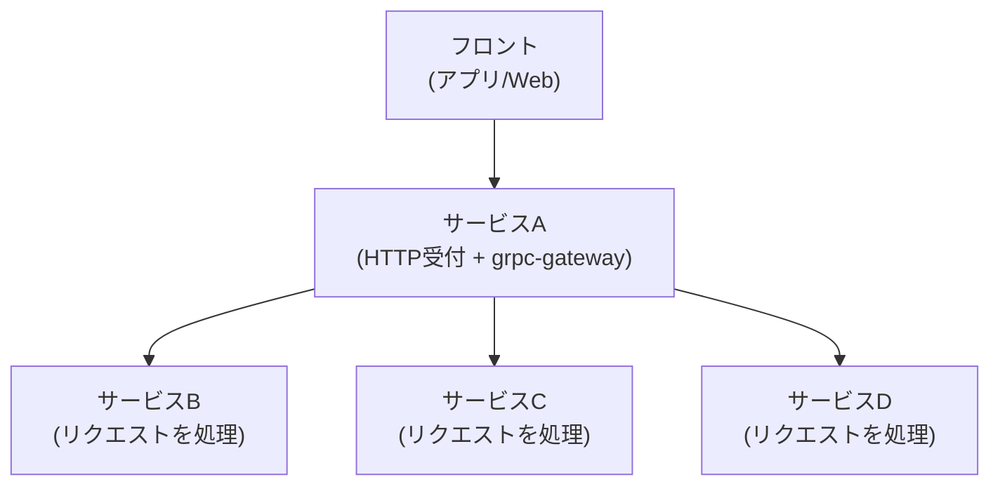
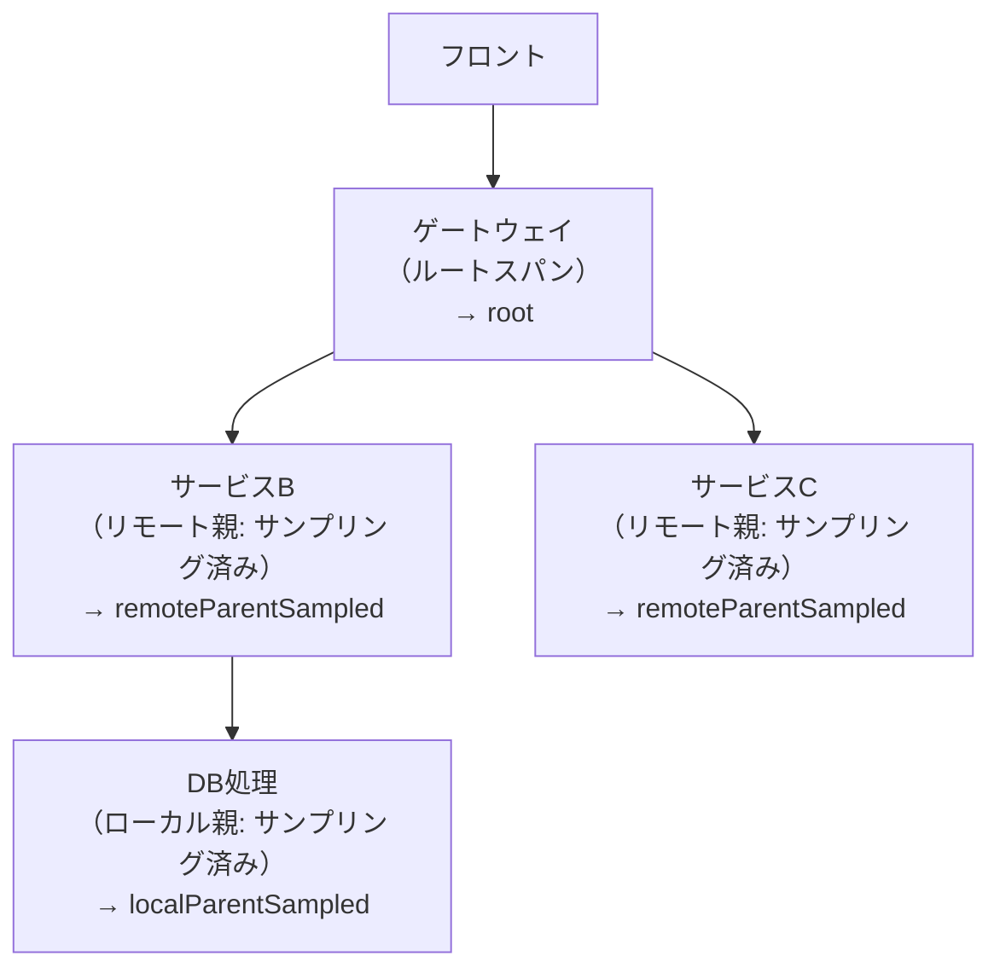

## 導入

複数のマイクロサービスで分散トレーシングを運用していると、次のような要望が出てきます。

- 重要な API のトレースは 100%サンプリングしたい
- ヘルスチェックのような監視用リクエストのトレースは収集したくない

本記事では、OpenTelemetry の Go SDK におけるサンプリングの仕組みを整理した上で、カスタムサンプラーを実装してこれらの要望を実現します。

## 想定される読者

- 複数サービスの分散トレーシングに興味がある
- トレースやスパンの基礎知識がある
- OpenTelemetry の SDK を用いて自前でサンプリングのロジックを実装したい

:::message
今回は SDK レベルで設定できるサンプリングの設定と実装例のみを紹介します。サンプリングの種類によるパフォーマンスの違いなどは説明しません。
:::

## サーバーの構成

本記事では、以下のような構成のバックエンドを想定します。

1. フロント（アプリ/Web）からのリクエストは HTTP で受け付ける
1. [grpc-gateway](https://github.com/grpc-ecosystem/grpc-gateway) を用いて、1 の HTTP リクエストを gRPC リクエストに変換し、対象のサービスの gRPC サーバーにリクエストを送る
1. 2 で処理を受け付けた複数のマイクロサービスがリクエストを処理する


```mermaid
graph TD
    A["フロント<br/>(アプリ/Web)"] --> B["サービスA<br/>(HTTP受付 + grpc-gateway)"]
    B --> C["サービスB<br/>(リクエストを処理)"]
    B --> D["サービスC<br/>(リクエストを処理)"]
    B --> E["サービスD<br/>(リクエストを処理)"]
```

"gateway" 的なサービスがフロントからのリクエストを受け付け、それを gRPC に変換して後続のマイクロサービスに送る、という流れです。

## SDK におけるサンプリングの実装

まずはサンプリングの責務を担っている型を見ていきます。より詳細な説明は [Tracing SDK#Sampler](https://opentelemetry.io/docs/specs/otel/trace/sdk/#sampler) を参照してください。

なお、本記事のコード引用は `go.opentelemetry.io/otel/sdk` v1.37.0 のものです。

### サンプリングを行うインターフェイス `Sampler`

サンプリングは `Sampler` インターフェイスの `ShouldSample` メソッドによって行われます。

```go
type Sampler interface {
	// サンプリングを行うかどうかを決めるメソッド
	ShouldSample(parameters SamplingParameters) SamplingResult
	// 補足説明を返すメソッド。デバッグなどで用いる
	Description() string
}
```

`SamplingParameters` を受け取って `SamplingResult` を返す、シンプルなインターフェイスです。

### サンプリングの判断材料 `SamplingParameters`

`SamplingParameters` の定義は下記のようになっています。

```go
type SamplingParameters struct {
	ParentContext context.Context
	TraceID       trace.TraceID
	Name          string
	Kind          trace.SpanKind
	Attributes    []attribute.KeyValue
	Links         []trace.Link
}
```

親スパンの Context である `ParentContext` や、スパンに付与される Key-Value ペアである `Attributes` などを保持しています。これらの情報を用いてサンプリングするかどうかを決定すれば良いわけです。

### サンプリングの結果 `SamplingResult`

サンプリングするかどうかの決定は `SamplingResult` として返されます。

```go
type SamplingResult struct {
	Decision   SamplingDecision
	Attributes []attribute.KeyValue
	Tracestate trace.TraceState
}
```

`Decision` フィールドの型である `SamplingDecision` は以下の 3 つのいずれかです。

```go
const (
	// スパンを記録しない
	Drop SamplingDecision = iota
	// スパンを記録するが、サンプリング済みフラグは立てない
	RecordOnly
	// スパンを記録し、サンプリング済みフラグを立てる
	RecordAndSample
)
```

エクスポーターに送られるのはサンプリング済みフラグ（`trace.FlagsSampled`）が立ったスパンだけです[^1]。そのため、トレースをバックエンドに送る/送らないを制御する用途では `Drop` か `RecordAndSample` の 2 つを使うことになります。

[^1]: `BatchSpanProcessor` と `SimpleSpanProcessor` のいずれも、サンプリング済みフラグが立っていないスパンをエクスポート対象から除外します。

また `SamplingResult` の `Tracestate` フィールドには、`SamplingParameters` の `ParentContext` から取り出した値をそのまま指定するのが基本です。

```go
	SamplingResult{
		// 他のフィールドは省略
		Tracestate: trace.SpanContextFromContext(p.ParentContext).TraceState(),
	}
```

これは [Tracing SDK#ShouldSample](https://opentelemetry.io/docs/specs/otel/trace/sdk/#shouldsample) にある下記の記載に沿ったものです。

> A `Tracestate` that will be associated with the `Span` ...（中略）... so samplers SHOULD normally return the passed-in `Tracestate` if they do not intend to change it.

## `ShouldSample` メソッドはどのタイミングで呼ばれるのか

サンプリングを決める型が分かったので、次は「どのタイミングで `ShouldSample` が呼ばれるのか」を確認します。

[Tracing SDK#SDK Span creation](https://opentelemetry.io/docs/specs/otel/trace/sdk/#sdk-span-creation) には、スパン生成時の手順として以下のような記載があります（一部省略しています）。

1. 親のトレース ID が有効ならばそれを用いる。そうでなければトレース ID を生成する
1. `ShouldSample` メソッドを呼ぶ
1. サンプリングの結果に関係なくスパン ID を生成する
1. 2 の結果に応じてスパンを生成する

ここで重要なのは、生成の順番よりも **スパンを生成するたびに `ShouldSample` メソッドが呼ばれる** という点です。

つまり、A -> B -> C のような親子関係でスパンが生成される場合、B をサンプリングしたからといって A や C が自動的にサンプリングされるわけではない、ということになります。

## サンプリングの種類

SDK に用意されているサンプラーを見ていきます。後述するカスタムサンプラーも、これらを組み合わせて実装します。

### [`AlwaysOn`](https://opentelemetry.io/docs/specs/otel/trace/sdk/#alwayson)

全てのトレースをサンプリングする最もシンプルなサンプラーです。SDK では `AlwaysSample` 関数として実装されています。

```bash
❯ go doc go.opentelemetry.io/otel/sdk/trace.AlwaysSample
package trace // import "go.opentelemetry.io/otel/sdk/trace"

func AlwaysSample() Sampler
    AlwaysSample returns a Sampler that samples every trace. Be careful about
    using this sampler in a production application with significant traffic:
    a new trace will be started and exported for every request.
```

`ShouldSample` の実装は以下のようになっています。名前の通り、常に `RecordAndSample` を返します。

```go
func (as alwaysOnSampler) ShouldSample(p SamplingParameters) SamplingResult {
	return SamplingResult{
		Decision:   RecordAndSample,
		Tracestate: trace.SpanContextFromContext(p.ParentContext).TraceState(),
	}
}
```

### [`AlwaysOff`](https://opentelemetry.io/docs/specs/otel/trace/sdk/#alwaysoff)

全てのトレースを破棄する最もシンプルなサンプラーです。SDK では `NeverSample` 関数として実装されています。

```bash
❯ go doc go.opentelemetry.io/otel/sdk/trace.NeverSample
package trace // import "go.opentelemetry.io/otel/sdk/trace"

func NeverSample() Sampler
    NeverSample returns a Sampler that samples no traces.
```

`ShouldSample` の実装は以下のようになっています。こちらは常に `Drop` を返します。

```go
func (as alwaysOffSampler) ShouldSample(p SamplingParameters) SamplingResult {
	return SamplingResult{
		Decision:   Drop,
		Tracestate: trace.SpanContextFromContext(p.ParentContext).TraceState(),
	}
}
```

### [`TraceIdRatioBased`](https://opentelemetry.io/docs/specs/otel/trace/sdk/#traceidratiobased)

トレース ID に基づいて、指定した割合のトレースをサンプリングするサンプラーです。SDK では `TraceIDRatioBased` 関数として実装されています。

```bash
❯ go doc go.opentelemetry.io/otel/sdk/trace.TraceIDRatioBased
package trace // import "go.opentelemetry.io/otel/sdk/trace"

func TraceIDRatioBased(fraction float64) Sampler
    TraceIDRatioBased samples a given fraction of traces. Fractions >= 1 will
    always sample. Fractions < 0 are treated as zero. To respect the parent
    trace's `SampledFlag`, the `TraceIDRatioBased` sampler should be used as a
    delegate of a `Parent` sampler.
```

実装は以下のようになっています。

```go
func TraceIDRatioBased(fraction float64) Sampler {
	if fraction >= 1 {
		return AlwaysSample()
	}

	if fraction <= 0 {
		fraction = 0
	}

	return &traceIDRatioSampler{
		traceIDUpperBound: uint64(fraction * (1 << 63)),
		description:       fmt.Sprintf("TraceIDRatioBased{%g}", fraction),
	}
}

func (ts traceIDRatioSampler) ShouldSample(p SamplingParameters) SamplingResult {
	psc := trace.SpanContextFromContext(p.ParentContext)
	x := binary.BigEndian.Uint64(p.TraceID[8:16]) >> 1
	if x < ts.traceIDUpperBound {
		return SamplingResult{
			Decision:   RecordAndSample,
			Tracestate: psc.TraceState(),
		}
	}
	return SamplingResult{
		Decision:   Drop,
		Tracestate: psc.TraceState(),
	}
}
```

`fraction` に `1` 以上を指定すると `AlwaysSample()` がそのまま返され、`0` 以下を指定すると閾値が `0` になり全てのトレースが `Drop` されます。

判定は、トレース ID の後半 8 バイトを数値に変換し、`fraction` から計算された閾値（`traceIDUpperBound`）と比較するだけです。同じトレース ID であれば常に同じ結果になる、決定論的なサンプリングです。

一方で、実装を見ると分かる通り **親スパンのサンプリング状態は一切考慮されません**。go doc にも、親トレースの `SampledFlag` を尊重するには `ParentBased` の delegate として使うべきという注意書きがあります。

### [`ParentBased`](https://opentelemetry.io/docs/specs/otel/trace/sdk/#parentbased)

親スパンの存在とサンプリング状態に基づいてサンプリングを決定するサンプラーです。SDK では `ParentBased` 関数として実装されています。

```bash
❯ go doc go.opentelemetry.io/otel/sdk/trace.ParentBased
package trace // import "go.opentelemetry.io/otel/sdk/trace"

func ParentBased(root Sampler, samplers ...ParentBasedSamplerOption) Sampler
    ParentBased returns a sampler decorator which behaves differently, based on
    the parent of the span. If the span has no parent, the decorated sampler
    is used to make sampling decision. If the span has a parent, depending on
    whether the parent is remote and whether it is sampled, one of the following
    samplers will apply:
      - remoteParentSampled(Sampler) (default: AlwaysOn)
      - remoteParentNotSampled(Sampler) (default: AlwaysOff)
      - localParentSampled(Sampler) (default: AlwaysOn)
      - localParentNotSampled(Sampler) (default: AlwaysOff)
```

`ShouldSample` の実装は以下のようになっています。

```go
func (pb parentBased) ShouldSample(p SamplingParameters) SamplingResult {
	psc := trace.SpanContextFromContext(p.ParentContext)
	if psc.IsValid() {
		if psc.IsRemote() {
			if psc.IsSampled() {
				return pb.config.remoteParentSampled.ShouldSample(p)
			}
			return pb.config.remoteParentNotSampled.ShouldSample(p)
		}

		if psc.IsSampled() {
			return pb.config.localParentSampled.ShouldSample(p)
		}
		return pb.config.localParentNotSampled.ShouldSample(p)
	}
	return pb.root.ShouldSample(p)
}
```

**親スパンの存在・リモート/ローカル・サンプリング状態** の組み合わせに応じて、`root` を含む 5 つのサンプラーを使い分けます。デフォルトでは「サンプリング済みの親を持つ子スパンはサンプリングし、サンプリングされていない親を持つ子スパンは破棄する」という設定になっており、これによりトレース全体で一貫したサンプリング判定が保たれます。

#### 具体例

少々複雑なので、具体例で確認します。以下のようなサービス構成/スパン生成を考えます。


```mermaid
graph TD
    A["フロント"] --> B["ゲートウェイ<br/>（ルートスパン）<br/>→ root"]
    B --> C["サービスB<br/>（リモート親: サンプリング済み）<br/>→ remoteParentSampled"]
    B --> D["サービスC<br/>（リモート親: サンプリング済み）<br/>→ remoteParentSampled"]
    C --> E["DB処理<br/>（ローカル親: サンプリング済み）<br/>→ localParentSampled"]
```

1. ゲートウェイサービスでルートスパンが生成され、サンプリングされたと仮定する
   - ゲートウェイからすると親スパンがないので、`pb.root.ShouldSample(p)` が実行される
1. サービス B、サービス C では、ゲートウェイで生成されたスパンが親スパンになる。他サービスで生成されたスパンなので `IsRemote()` が true を返し、`remoteParentSampled.ShouldSample(p)` が実行される
   - デフォルトでは `AlwaysOn` なのでサンプリングされる
1. サービス B 内の DB 処理では、親スパンはローカルかつサンプリング済みなので `localParentSampled.ShouldSample(p)` が実行される
   - デフォルトでは `AlwaysOn` なのでサンプリングされる

ルートスパンの判定に子孫のスパンが全て従うことで、トレースの一部だけが欠けるといった不完全なトレースの発生を防いでいます。

## ここまでのまとめと疑問

ここまでで以下のことが分かりました。

- `Sampler` インターフェイスの `ShouldSample` メソッドが、スパンを生成するたびにサンプリングするかどうかを決定する
- SDK には `AlwaysOn`、`AlwaysOff`、`TraceIdRatioBased`、`ParentBased` が用意されている

一方で、筆者は次の 2 つの疑問を持ちました。

1. トレースは重要なので、全てのスパンをサンプリングする `AlwaysOn` だけで良いのではないか
1. `TraceIdRatioBased` は決定論的なので、`ParentBased` と組み合わせる必要はないのではないか

### 疑問 1. `AlwaysOn` だけで良いのではないか

開発環境では `AlwaysOn` でも問題ありませんが、本番環境では全てのリクエストでトレースが生成・エクスポートされることになります。`AlwaysSample` の go doc にも次の注意書きがあります。

> Be careful about using this sampler in a production application with significant traffic: a new trace will be started and exported for every request.

トラフィックの多いサービスでは、トレースデータのストレージコスト、エクスポート処理のオーバーヘッド、分析ツールへの負荷が問題になります。本番環境では何らかのサンプリング戦略が必要です。

### 疑問 2. `ParentBased` と組み合わせる必要はないのではないか

トレース ID はトレース内の全てのスパンで共通で、`TraceIdRatioBased` の判定はトレース ID だけで決まります。そのため、理論上は全サービスに同じ割合の `TraceIdRatioBased` を設定すれば、トレースが途中で欠けることはありません。

ただしそれは「全サービスで割合の設定が完全に揃っている」ことが前提です。

```go
samplerA := trace.TraceIDRatioBased(0.1)  // サービスA: 10%
samplerB := trace.TraceIDRatioBased(0.05) // サービスB: 負荷が高いので5%
```

前述の通り `TraceIdRatioBased` は親のサンプリング状態を見ないため、上記のようにサービスごとに割合が異なると、同じトレースでもサービスによって判定が分かれ、トレースが断片化します。全サービスの設定を揃え続けるという運用も現実的ではありません。

`ParentBased(TraceIDRatioBased(0.1))` のように組み合わせて「割合の判定はルートスパンだけで行い、子孫は親の判定に従う」構成にすれば、サンプリング割合の管理はルートスパンを生成するサービスだけで済み、トレース全体の一貫性も保たれます。

## 実際に試してみる

ここからは実際に SDK を用いてサンプリングを実装していきます。

検証に使うサーバーは以下の構成です。「サーバーの構成」の節で示した図の、サービス A が "gateway"、サービス B/C が "book" と "author" に対応します。

1. grpc-gateway で作成された "gateway" サーバーが HTTP のリクエストを受け付け、gRPC に変換して必要なサービスにリクエストを送る
1. "book" サーバーと "author" サーバーは gRPC でリクエストを受け付けて処理し、データを MySQL から取得する

HTTP は [otelhttp](https://pkg.go.dev/go.opentelemetry.io/contrib/instrumentation/net/http/otelhttp)、gRPC は [otelgrpc](https://pkg.go.dev/go.opentelemetry.io/contrib/instrumentation/google.golang.org/grpc/otelgrpc)、MySQL は [otelsql](https://github.com/uptrace/opentelemetry-go-extra/tree/main/otelsql) で計装しており、トレースは OTLP で Jaeger にエクスポートしています。バージョンは Go 1.24.1、`go.opentelemetry.io/otel/sdk` v1.37.0、otelhttp/otelgrpc v0.62.0 です。

サンプルコードは https://github.com/k3forx/opentelemetry/tree/main/grpc_gateway_distributed_system に置いています。

また、`ShouldSample` に何が渡ってきてどう判定されたのかを観察するために、以下のようなデバッグ用サンプラーを挟んでいます。なお、本記事のカスタムサンプラーのコードでは以下の import エイリアスを使います（以降のコードでは省略します）。

```go
import (
	sdktrace "go.opentelemetry.io/otel/sdk/trace"
	semconv "go.opentelemetry.io/otel/semconv/v1.24.0"
	oteltrace "go.opentelemetry.io/otel/trace"
)
```

```go
// loggingSampler は ShouldSample に渡ってくる情報と判定結果を観察するためのデバッグ用サンプラー
type loggingSampler struct {
	next sdktrace.Sampler
}

func (s *loggingSampler) ShouldSample(p sdktrace.SamplingParameters) sdktrace.SamplingResult {
	res := s.next.ShouldSample(p)
	psc := oteltrace.SpanContextFromContext(p.ParentContext)
	fmt.Printf("[sampler] name=%q kind=%s parent(valid=%t remote=%t sampled=%t) decision=%d\n",
		p.Name, p.Kind, psc.IsValid(), psc.IsRemote(), psc.IsSampled(), res.Decision)
	for _, attr := range p.Attributes {
		fmt.Printf("[sampler]   attr %s=%v\n", attr.Key, attr.Value.Emit())
	}
	return res
}

func (s *loggingSampler) Description() string {
	return s.next.Description()
}
```

### HTTP + gRPC + MySQL の全てのトレースを取得する

まずは分かりやすいように `AlwaysOn` で全てのトレースを取得します。`TracerProvider` の生成時に `WithSampler` でサンプラーを指定するだけです。

```go
tp := sdktrace.NewTracerProvider(
	sdktrace.WithSampler(sdktrace.AlwaysSample()),
	sdktrace.WithBatcher(exp),
	sdktrace.WithResource(resource),
)
```

この状態で gateway サーバーに出力されるサンプラーのログを見てみます。今回の検証環境では Docker のヘルスチェックが 30 秒ごとに `/v1/health` を叩くため、何もしなくても以下のようなログが出続けます（属性は一部省略しています）。

```text
[sampler] name="HTTP GET /v1/health" kind=server parent(valid=false remote=false sampled=false) decision=2
[sampler]   attr server.address=localhost
[sampler]   attr http.request.method=GET
[sampler]   attr url.scheme=http
[sampler]   attr user_agent.original=curl/7.74.0
[sampler]   attr url.path=/v1/health
[sampler]   attr network.protocol.version=1.1
```

このログから以下のことが分かります。

- otelhttp が生成するサーバースパンの `ShouldSample` には、スパン名や `SpanKind`（`server`）に加えて、`url.path` などの属性が渡ってくる
- ヘルスチェックのリクエストには親スパンがないので、ルートスパンとして生成される（`parent(valid=false ...)`）
- `AlwaysOn` なので判定は `RecordAndSample`（`decision=2`）となり、Jaeger にエクスポートされる

全てのトレースが取得できる一方で、30 秒ごとのヘルスチェックのような監視用リクエストのトレースまで際限なくエクスポートされてしまいます。疑問 1 で見た「`AlwaysOn` だけで良いのではないか」の課題を早速体感できました。

### ヘルスチェック（`/v1/health`）のトレースを除外する

先ほどのログで確認した通り、`ShouldSample` には `url.path` 属性が渡ってきます。これを使って `/v1/health` のスパンだけを `Drop` するカスタムサンプラーを実装します。

```go
// dropPathSampler は url.path が path に一致するサーバースパンを Drop し、
// それ以外は next に委譲するサンプラー
type dropPathSampler struct {
	path string
	next sdktrace.Sampler
}

func (s *dropPathSampler) ShouldSample(p sdktrace.SamplingParameters) sdktrace.SamplingResult {
	if p.Kind == oteltrace.SpanKindServer {
		for _, attr := range p.Attributes {
			if attr.Key == semconv.URLPathKey && attr.Value.AsString() == s.path {
				return sdktrace.SamplingResult{
					Decision:   sdktrace.Drop,
					Tracestate: oteltrace.SpanContextFromContext(p.ParentContext).TraceState(),
				}
			}
		}
	}
	return s.next.ShouldSample(p)
}

func (s *dropPathSampler) Description() string {
	return fmt.Sprintf("DropPathSampler{path:%s}", s.path)
}
```

gateway サーバーのサンプラーを差し替えます。

```go
sdktrace.WithSampler(&dropPathSampler{path: "/v1/health", next: sdktrace.AlwaysSample()}),
```

再びヘルスチェックのログを見ると、同じスパンの判定が `Drop`（`decision=0`）に変わり、エクスポートされなくなりました（属性は一部省略しています）。

```text
[sampler] name="HTTP GET /v1/health" kind=server parent(valid=false remote=false sampled=false) decision=0
[sampler]   attr http.request.method=GET
[sampler]   attr url.path=/v1/health
```

ヘルスチェックのスパンはルートスパンで、かつ子スパンを持たないため、単純に `Drop` するだけで済みます。

:::message
otelhttp には `otelhttp.WithFilter` というオプションがあり、計装レベルで「スパンをそもそも生成しない」ことでも同じ結果が得られます。特定の計装だけで完結するなら `WithFilter`、SDK 全体で一元管理したいならカスタムサンプラー、という使い分けになります。
:::

### gRPC のクライアントのトレースを除外する

次に「gateway サーバーが生成する gRPC クライアントスパンは冗長なので除外したい」というケースを考えます。`SamplingParameters` には `Kind` が渡ってくるので、クライアントスパンだけを `Drop` するサンプラーは簡単に書けます。

```go
// dropGRPCClientSampler はクライアントスパンを Drop し、それ以外は next に委譲するサンプラー
type dropGRPCClientSampler struct {
	next sdktrace.Sampler
}

func (s *dropGRPCClientSampler) ShouldSample(p sdktrace.SamplingParameters) sdktrace.SamplingResult {
	if p.Kind == oteltrace.SpanKindClient {
		return sdktrace.SamplingResult{
			Decision:   sdktrace.Drop,
			Tracestate: oteltrace.SpanContextFromContext(p.ParentContext).TraceState(),
		}
	}
	return s.next.ShouldSample(p)
}
```

しかし、このサンプラーを gateway サーバーに適用すると **下流サービスのスパンまで全て消えてしまいます**。以下のテストで一連の流れを確認できます。

```go
gatewayTP := sdktrace.NewTracerProvider(
	sdktrace.WithSampler(&dropGRPCClientSampler{next: sdktrace.ParentBased(sdktrace.AlwaysSample())}),
)
downstreamTP := sdktrace.NewTracerProvider(
	sdktrace.WithSampler(sdktrace.ParentBased(sdktrace.AlwaysSample())),
)
propagator := propagation.TraceContext{}

// 1. gateway でルートスパン（サーバー）を生成 → サンプリングされる
rootCtx, rootSpan := gatewayTP.Tracer("test").Start(context.Background(), "HTTP GET /v1/books/1",
	oteltrace.WithSpanKind(oteltrace.SpanKindServer))
rootSpan.SpanContext().IsSampled() // true

// 2. gateway で gRPC クライアントスパンを生成 → Drop される
clientCtx, clientSpan := gatewayTP.Tracer("test").Start(rootCtx, "book.v1.BookService/GetBook",
	oteltrace.WithSpanKind(oteltrace.SpanKindClient))
clientSpan.SpanContext().IsSampled() // false

// 3. クライアントスパンのコンテキストが traceparent（トレースコンテキストを
//    伝搬する W3C 標準のヘッダ）として伝搬される
//    （otelgrpc が gRPC メタデータで行うことを propagator で直接再現）
carrier := propagation.MapCarrier{}
propagator.Inject(clientCtx, carrier)
carrier.Get("traceparent") // "00-{trace-id}-{span-id}-00" ← 末尾の sampled フラグが 00

// 4. 下流サービスで伝搬されたコンテキストからサーバースパンを生成
//    → リモート親が未サンプリングなので ParentBased は Drop する
downstreamCtx := propagator.Extract(context.Background(), carrier)
_, serverSpan := downstreamTP.Tracer("test").Start(downstreamCtx, "GetBook",
	oteltrace.WithSpanKind(oteltrace.SpanKindServer))
serverSpan.SpanContext().IsSampled() // false
```

なぜこうなるかは SDK のスパン生成処理を見ると分かります。`ShouldSample` の判定結果は、生成されるスパンの `SpanContext` にサンプリング済みフラグとして反映されます。

```go
if isSampled(samplingResult) {
	scc.TraceFlags = psc.TraceFlags() | trace.FlagsSampled
} else {
	scc.TraceFlags = psc.TraceFlags() &^ trace.FlagsSampled
}
```

クライアントスパンを `Drop` すると、このフラグ（`sampled=00`）が `traceparent` ヘッダとして下流サービスに伝搬されます。下流サービスの `ParentBased` は「リモート親が未サンプリング」と判断し、デフォルトの `remoteParentNotSampled`（= `AlwaysOff`）でスパンを `Drop` します。結果として、トレースは gateway のルートスパンだけになります。

つまり、**サンプラーの判定は「そのスパンだけ」ではなく、伝搬を通じて全ての子孫スパンに影響します**。サンプラーは「トレース単位」で取捨選択する仕組みと捉えるべきで、トレースの途中のスパンだけを間引く用途には向いていません。

この用途には計装レベルのフィルタが使えます。otelgrpc の `otelgrpc.WithFilter` はスパンを生成しないだけで、**親スパンのコンテキストをそのまま下流に伝搬する** ため、下流のトレースは壊れません[^2]。

[^2]: otelgrpc v0.62.0 の `clientHandler.TagRPC` は、フィルタで除外された場合スパンを生成せず、元のコンテキストに対して `inject` を実行します。

### 特定の API のトレースのみ 100%サンプリングする

最後に、冒頭の要望である「重要な API のトレースは 100%サンプリングし、それ以外は割合を絞る」を実現します。方針はここまでの内容の組み合わせです。

- サンプリングの判定はルートスパン（gateway サーバー）だけで行う
- 重要な API（今回は `/v1/authors` 配下）のルートスパンは無条件に `RecordAndSample` にする
- それ以外のルートスパンと子スパンの判定は `ParentBased` に委譲する
- 下流サービスは `ParentBased` のままにして、ルートの判定に従わせる

```go
// priorityAPISampler は url.path が pathPrefix から始まるルートスパンを常にサンプリングし、
// それ以外は next に委譲するサンプラー
type priorityAPISampler struct {
	pathPrefix string
	next       sdktrace.Sampler
}

func (s *priorityAPISampler) ShouldSample(p sdktrace.SamplingParameters) sdktrace.SamplingResult {
	psc := oteltrace.SpanContextFromContext(p.ParentContext)
	// ルートスパン（親スパンなし）のみ独自に判定する
	if p.Kind == oteltrace.SpanKindServer && !psc.IsValid() {
		for _, attr := range p.Attributes {
			if attr.Key == semconv.URLPathKey && strings.HasPrefix(attr.Value.AsString(), s.pathPrefix) {
				return sdktrace.SamplingResult{
					Decision:   sdktrace.RecordAndSample,
					Tracestate: psc.TraceState(),
				}
			}
		}
	}
	return s.next.ShouldSample(p)
}
```

gateway サーバーには次のように設定します。

```go
sdktrace.WithSampler(&priorityAPISampler{
	pathPrefix: "/v1/authors",
	next:       sdktrace.ParentBased(sdktrace.TraceIDRatioBased(0.1)),
}),
```

挙動を確定的に確認するため、`next` を `ParentBased(TraceIDRatioBased(0))`（対象 API 以外は全て破棄）にしてテストしたところ、以下の結果になりました。

- `/v1/authors/1` へのリクエストは、ルートスパン・gRPC クライアントスパン・伝搬先の下流サーバースパンの全てがサンプリングされる
- `/v1/books/1` へのリクエストは、ルートスパンの時点で `Drop` され、下流もサンプリングされない

対象 API の子孫スパンがサンプリングされるのは、gateway 内の子スパン（gRPC クライアントスパン）が `next` の `ParentBased` で「ローカル親がサンプリング済み → `AlwaysOn`」と判定され、そのフラグが下流にも伝搬されるためです。ルートスパンで判定を集約し、子孫を `ParentBased` で従わせるという基本形さえ押さえれば、「この API だけ 100%」のような要望はシンプルに実現できます。

## まとめ

- サンプリングは `Sampler` インターフェイスの `ShouldSample` メソッドで行われ、スパンを生成するたびに呼ばれる
- 判定結果はサンプリング済みフラグとして `traceparent` で下流に伝搬され、`ParentBased` はそれを尊重する。カスタムサンプラーを書くときは、そのスパン単体ではなくトレース全体・下流サービスへの影響を考える必要がある
- 「ルートスパンでトレース単位の判定を行い、子孫は `ParentBased` で従わせる」が基本形。これに `url.path` や `SpanKind` などの条件を組み合わせれば、「特定 API のみ 100%サンプリング」や「ヘルスチェックの除外」は数十行のカスタムサンプラーで実現できる
- スパン単位の間引き（gRPC クライアントスパンの除外など）はサンプラーではなく、`otelhttp.WithFilter` や `otelgrpc.WithFilter` のような計装レベルのフィルタで行う

今回は SDK レベル（ヘッドサンプリング）のみを扱いました。「エラーが発生したトレースだけ残す」のような、結果を見てからの判断はテイルサンプリングの領域になるので、OpenTelemetry Collector の [tailsamplingprocessor](https://github.com/open-telemetry/opentelemetry-collector-contrib/tree/main/processor/tailsamplingprocessor) などを検討してください。
