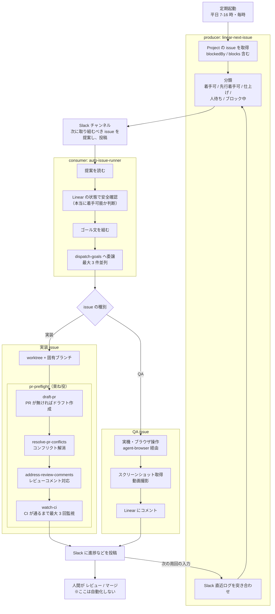

## 目的

1. 巷では半自動で開発させているという噂を聞くが、本当にできるかどうか試してみたかった
2. 自分の力でどこまで自動化できるのか試してみたかった

:::message alert
AI の専門家ではないので、ハーネスエンジニアリングやループエンジニアリング、ソフトウェアファクトリーなどといった言葉は使用していません。また、自分がやっていることがそれらに該当しているとも思いません。
:::

## 対象の Project

2つの Linear Project を対象に PoC を実施しました。

<!-- TODO: 対象 Project の概要を追記（Notion では Linear Project の埋め込みだった） -->

## PoC の概要

### 前提

- 設計はある程度決まっている前提
  - AI のみでやりきることは難しい
  - 大枠の方向性が間違っていると手戻り自体が大きくなる
- スコープを区切るようにした
  - 要件定義 〜 設計、設計完了 〜 実装完了、QA開始 〜 リリースまでの大きく分けて3つのフェーズがある
  - まずは設計完了 〜 実装完了、QA開始 〜 <!-- TODO: 文が途中で切れているので補完 -->

### 全体的な構成

- 提案・実行・人のレビューとマージの3層
  - 提案と実行は Slack を挟み、直接呼び合わない
  - ざっくりといえば、`linear-next-issue` が次やることを判断・提示し、`auto-issue-runner` がピックアップして取り組む
- 図中の分類ラベルは `linear-next-issue` が issue ごとに付ける

| ラベル       | 状態                                                                        | `auto-issue-runner` スキルの対応 |
| ------------ | --------------------------------------------------------------------------- | -------------------------------- |
| ✅仕上げ     | 承認が揃っていて、残りは自分がマージするだけ                                | 着手しない（マージ系は禁止）     |
| ✅着手可     | 未完了のブロッカーなし                                                      | 着手する                         |
| ✅先行着手可 | 未完了ブロッカーが1件だけで、それがレビュー中。そのブランチに積んで先に着手 | 着手する                         |
| ⏳人待ち     | 他者のレビュー待ちで、自分では動かせない                                    | 着手しない                       |
| ⛔ブロック中 | 未完了ブロッカーが2件以上、またはレビュー中以外                             | 着手しない                       |

- 図中の「Linear の状態で安全確認」は、提案をそのまま実行せず、着手直前に Linear の現在の状態を引き直す処理（二重着手ガード）
  - 提案は投稿時点のスナップショットなので、実行までの間に状態が変わっていることがあるため

| 確認すること                           | 候補を落とす条件                                                                                                                                                              |
| -------------------------------------- | ----------------------------------------------------------------------------------------------------------------------------------------------------------------------------- |
| issue のステータス                     | started / completed / canceled なら既に対応中か済みとみなす。GitHub 連携は PR が開くと In Progress に動くので、「started ＝ PR か worktree がもうある」と読める               |
| 未完了ブロッカーの数（先行着手可のみ） | 2件以上なら積む先のブランチが定まらない。Done のブロッカーは master にマージ済みなので数えない（例えば、A, B, C の issue をやってから、D をやらないといけない状況などを想定） |
| ブロッカーの open PR（先行着手可のみ） | PR が未作成なら積む先が無く、main から着手すると lint などが落ちるため                                                                                                        |
| issue の種別                           | 実装か QA か判じがたいものは取り掛からない                                                                                                                                    |

次にやるべき issue を提案している様子です。

<!-- TODO: 画像「次に着手可能な issue が提示されている」を差し込む（社内 Slack のスクショなのでマスキングを確認） -->

実際に作業している様子です。

<!-- TODO: 画像「作業完了（この投稿はコンフリクトの解消）を報告している様子」を差し込む -->
<!-- TODO: 画像「着手可能な issue の QA のスタートを報告している様子」を差し込む -->

### 作成した / 使用したスキル一覧

| スキル                    | 役割                                                                                                                                      |
| ------------------------- | ----------------------------------------------------------------------------------------------------------------------------------------- |
| `linear-next-issue`       | 依存グラフと Slack ログから次の1件を決め、Slack に投稿                                                                                    |
| `auto-issue-runner`       | 提案を読み、ゴール文を組んで `dispatch-goals` に委譲（最大3件並列）。オーケストレーター的な役割で、実際の実装などはサブエージェントに委譲 |
| `dispatch-goals`          | ゴールとタイムアウトを渡して実行。未達でも原因つきで報告。タイムアウトを設定しないと永遠にトークンを消費し続けるため                      |
| `pr-preflight`            | 下の4つに委譲する束ね役。自身にロジックはない                                                                                             |
| `draft-pr`                | ブランチ作成・コミット・ドラフト PR 作成                                                                                                  |
| `resolve-pr-conflicts`    | base を取り込む向きで merge。rebase / force-push はしない                                                                                 |
| `address-review-comments` | bot 指摘は自動対応、人の指摘は方針提示まで                                                                                                |
| `watch-ci`                | 全 CI 完了まで監視して通知                                                                                                                |

### 設計のポイント

1. Slack を唯一のインターフェースに
   - 提案側と実行側を切り離せる
   - 人が途中で割り込める
   - **判断の履歴が残る**
     - ここが一番のポイント
     - いつ何がどこまで進んだのか（≒ コンテキスト）を一箇所に集約できる
     - 例えば人間同士の会話や、GitHub の PR のコメントなども連携できる
   - Project に紐づいたチャンネルだけ自動承認するので誤爆しない
2. 「ゴールを考えること」と「そのゴールを実行すること」を別々にやらせた
   - トークン節約のため
   - **ゴールを実行する ≒ ほとんど指示遂行能力のみが問われる部分なので、sonnet などの安いモデルに任せることができる**
   - タイムアウトにより途中でゴールが達成できなくても、それまでの結果を親エージェントに報告し、Slack に投稿するので次回実行時にそれらの情報を元にモデルを実行できる
3. 自分のやり方をうまくスキルに落とし込む
   - 例えば、A → B の依存関係があるタスクの場合、A がレビュー中なら B も着手して良い、みたいな判断をスキルに落とし込む
   - 例えば、動作確認は agent-browser か agent-device にやらせて、証跡付きで issue にコメントさせる

### 安全装置（何をやらせないかの設計）

| やらせないこと                                      | 理由                                                           |
| --------------------------------------------------- | -------------------------------------------------------------- |
| マージ系は一切禁止                                  | マージは不可逆                                                 |
| `gh pr ready` を打たず、ドラフトのまま維持          | ready 化は人の判断。人に出して良い品質のコードか？を人が判断   |
| force-push / rebase / 履歴書き換えをしない          | 他人の作業を壊さない                                           |
| 人のレビューコメントに自動返信・自動 resolve しない | 返信は人の名前で出る。bot 専有スレッドだけ自動で返信 & resolve |
| 実行者以外が作成した PR は完全読み取り専用          | 他人の PR を勝手に触らない                                     |
| Slack チャンネルを解決できなければ何もせず終了      | 誤ったチャンネルへの自動投稿を防ぐ                             |
| タイムアウトしても未達原因つきで報告                | 誤った完了報告を防ぐ                                           |

並列は最大3件としました。
もっと並列度を上げることはできますが、人のチェックが追いつかないためです。

## 実績

|          | Project A                                                            | Project B                                                                                              |
| -------- | -------------------------------------------------------------------- | ------------------------------------------------------------------------------------------------------ |
| 位置づけ | PoC / 試作フェーズ                                                   | 本格運用                                                                                               |
| 期間     | 6/30 17:33 初回投稿 → 7/2 14:15 完了（2.5日）                        | 7/3 起票 → 8/24 A/B テスト開始                                                                         |
| issue    | 5 件                                                                 | 103 件（Done 85 / Canceled 16 / 重複 2）                                                               |
| PR       | 4 本                                                                 | 69 本                                                                                                  |
| 稼働     | 3 日                                                                 | 19 日（最大 9 本/日・7/6）                                                                             |
| 人の関与 | ほとんどノータッチ、実装も QA も出来上がったものの確認しかしていない | 特に QA 周りはガッツリ関与。QA の指摘をうまいこと issue に分解したり、原因を調査するところは大変だった |

## 所感

### うまくいったところ 👍

1. 元々の設計が割とうまくいった
   1. モデルが賢いので、優先順位を決めたり、issue ごとのゴールを考える → サブエージェントに実装を依頼する部分はかなりうまく動いてくれた（自分のタスクの判断基準を言語化し、スキルに落とし込んだ）
   2. Slack チャンネルに全てのコンテキストを集める考えも割とうまくワークした
   3. 今回は一人でやった Project だが「デザイナーとの会話で UI が変更された」「PR のコメントで TODO タスクが発生した」みたいなケースも Slack にコンテキストとして集約できるのは大きなメリットだと感じた
2. 数日で終わるような Project であれば、正しいツールさえ与えていればほとんど人間の関与なしで完了できる
3. 人間がやるより早いケースがある
   1. 並列で動かした時: 7/29 18:59 に実装3件へ同時着手 → 19:47 に done 3 / 未達 0。48 分で3本

### うまくいかなかったこと 👎

1. いくつかの issue で制限時間内に設定されたゴールが達成できない時があった
   <!-- TODO: 画像「ビルドに時間がかかり、制限時間内に設定されたゴールが達成できなかった場合の slack 投稿」を差し込む -->
2. 設計や調査はまだ人間の手助けが必要な場面が多く、難易度の高い設計を含む開発の自動化は今回の仕組みでは難しかった
3. Slack は誰でも発言、なんでも連携できるが故のコンテキストの圧迫がありそうだと感じた
   1. めちゃめちゃ Slack を読み込む必要があったりして、トークン消費が激しい場面があった
4. 定期実行なため、待ちの時間がある

## 今後

- ループエンジニアリングとかソフトウェアファクトリーとかが指していることは一旦おいておいて、人間の関与をかなり減らした状態でもある程度の規模の Project ならおそらく自動で開発する仕組みは作れそう
  - ただし、最終的な品質のチェックは人間が行う必要はありそう
- バックエンドのコードだとまた違う結果になるかもしれない
- 設計の部分も半自動でできるようにさせたい気持ちがある一方で、大枠の改善方針はやはり人間が決める必要があるように思う
  - AI は壁打ちや抜けている観点がないかなどの補佐的な立ち位置で使うのが一番うまくいく気がしている
- 今回は定期実行だったので、イベント駆動にしたい気持ちがある
- 足りないスキルとかがありそう
  - `linear-next-issue` は最後の提案のポスト 〜 実行時までのすべての Slack を読み込み提案を考えるスキルだったが、役割を分担させても良かったかもしれない（コンテキスト圧迫を防ぐ + 責務の切り分け）
  - つまり「最後の提案のポストから最新のポストまでのすべての Slack 投稿を読み込み、サマリーを生成しポストするスキル」と「サマリーと Linear Project から次のタスクを提案するスキル」に分ける
  - あるいは「Slack で会話した内容を正とし、Linear Project に反映させる」とかも必要だったかも
