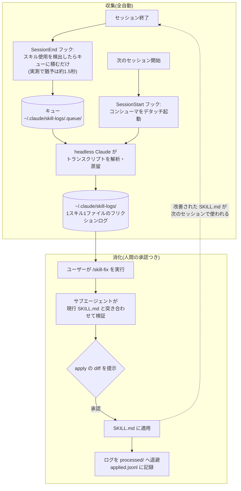

## 導入

みなさんは Claude Code のスキル（SKILL.md）をどれくらいの頻度で使用していますか？ 🤔

筆者は Web 系の開発をしており、開発するときには **必ず何かしらのスキルを使用** しています。おそらく Claude Code などの AI を使って開発している方の多くも、同じようにスキルを活用しているのではないかと思います。

さらに、そうしたスキルは自分やチームで自作したものであることも多いと思います。

### スキルの「モヤモヤ」

筆者自身もスキルを自作して使っているのですが、以下のような「モヤモヤ」を感じることが多くなりました 🧐

1. スキルが発動していてもなぜか時間がかかったり、出力がぶれたりしてしまう
1. スキルを作成してチームに展開したものの、どれくらい使用されているのかよくわからない
1. 日々のコードやドキュメントの更新にスキルの更新が追いついていない

つまり、**スキルを作成したものの、それらをブラッシュアップして、チームに還元する仕組みがない** というわけです。

この記事では、上記のような課題の解決を見据えて、前半では筆者が個人で回しているスキル運用の仕組みを紹介し、後半ではそれをチームに展開するための設計を考えたいと思います！

## まずは個人のスキルをブラッシュアップする

個人で作成しているスキルを対象に、**スキルをブラッシュアップする仕組み** を作ってみました 💡

その仕組みは、「収集」と「消化」の2つの段階からなるループです。



ポイントは、**収集は全自動・適用は人間の承認つき** という非対称な構成で半自動にしている点です。ログを集めるのはコストがかからないほど良く、スキルの書き換えは間違うと毎回の実行に影響するので、そこだけ人間の承認を必要としています！

「収集」側は、キュー積み・コンシューマの起動・加工の3ステップに分かれています。順に見ていきます。

### キュー積み - `SessionEnd` フックでスキルの発動を検出する

Claude Code には [`SessionEnd`](https://code.claude.com/docs/en/hooks#sessionend) というフックが存在します。

> Runs when a Claude Code session ends. Useful for cleanup tasks, logging session statistics, or saving session state. Supports matchers to filter by exit reason.

上記の説明の通り、セッションが終わる際にクリーンアップ処理を行ったり、セッションの統計をログに出したりする目的で使用できます。

フックのタイムアウトは公式ドキュメント上は既定で600秒ですが、`SessionEnd` ではセッション自体が閉じられる（プロセスが kill される）こともあるため、筆者の実測では約1.5秒でフックごと打ち切られました。**LLM でトランスクリプトを解析するような重い処理は、最後まで完了できる保証がありません。**

そこで `SessionEnd` フックは、セッション中にスキルが使われたかを確認して、使われていたらキュー用のディレクトリに JSON ファイルを出力する構成にしています。

```python
d = json.load(sys.stdin)  # フックは標準入力からセッション情報を受け取る
tp = d.get("transcript_path") or ""
if not tp:
    sys.exit(0)

# JSONをパースせず '"name":"Skill"' をチャンクスキャンするだけの早期リターン
used = False
with open(tp, "rb") as f:
    tail = b""
    for chunk in iter(lambda: f.read(1 << 20), b""):
        if b'"name":"Skill"' in tail + chunk:
            used = True
            break
        tail = chunk[-32:]  # チャンク境界をまたぐパターン対策
if not used:
    sys.exit(0)
```

ちなみに保存箇所は `~/.claude/skill-logs/.queue/<session_id>.json` としています。

### コンシューマの起動 - 次の `SessionStart` でコンシューマをデタッチ起動する

キューの消化役（コンシューマ）は、次にセッションが始まったタイミングで起動します。フックから普通にバックグラウンド起動すると起動元プロセスの終了に巻き込まれて死ぬことがあるので、`os.setsid()` で新しいプロセスセッションに切り離します。また、複数セッションを同時に開いたときにコンシューマが乱立しないよう、`mkdir` によるアトミックなロックで直列化しています。

### 加工 - headless Claude でログを「蒸留」する

解析の本体（以下、解析器）は headless モードの Claude です。

```bash
output="$(printf '%s' "$prompt" | claude --print --model sonnet \
  --settings '{"disableAllHooks":true}' \
  --no-session-persistence \
  --allowedTools Read)"
```

- `--settings '{"disableAllHooks":true}'`: 解析セッション自身が `SessionEnd` フックを発火して無限に再帰するのを防ぐ
- `--allowedTools Read`: 読み取り専用。ファイル書き込みは、Claude の出力（stdout）を受け取ったシェル側の `awk` が1スキル1ファイルに分割して行うので、書き込み許可まわりのプロンプトが一切出ない

プロンプトでは、そのセッションで呼ばれた各スキルについて「エラー箇所」と「曖昧だった指示」を抽出させ、指摘のあったスキルだけ1スキル1ファイルで `~/.claude/skill-logs/` に書き出します。実際に生成されたログの例がこちらです（レビュー待ち PR を棚卸しする `review-reminder` スキルに対するものの一部抜粋。実際のログには改善案のセクションも続きます）。

```markdown
# review-reminder

セッション終了: 20260703-092712

## 曖昧だった指示

- 実行当時のSKILL.mdは、0件時の出力は明確に規定していた一方、1件以上のケースについては
  「結果はMarkdownの表で出す」とだけ書かれ、初回返答に見出し・所感・アドバイスを付け足して
  よいかどうかが明記されていなかった。この情報不足のため、エージェントは実行のたびに見出しや
  状況コメントを即興で付与していた。
```

「どこで失敗したか」だけでなく、**「スキルのどの記述が足りなくてモデルの即興が発生したか」と改善案までが書かれている**のがポイントです。生のトランスクリプトは1セッションで数MBになることもありますが、この時点で数行〜十数行まで蒸留されます。この「蒸留」のおかげで、あとからログを見返すときに大量のデータを読み直す必要がありません 💡

### 消化 - `skill-fix` スキルでログを `SKILL.md` の修正に変換する

ログが溜まったら `/skill-fix` というスキルで消化します（スキルを直すスキルなので、メタスキルですね）。

ここで大事にしているのは「**ログの改善案は提案であって正解ではない**」という原則です。改善案は「スキル出力のぶれ」が起きた時点の `SKILL.md` に対するものなので、行番号がずれていたり、既に直っている項目や一過性の項目が混ざっていたりします。そこでスキルごとに検証用のサブエージェントを立てて、**現行の SKILL.md を正として**各指摘を分類させます。

| 分類             | 意味                                   | 扱い                                                    |
| ---------------- | -------------------------------------- | ------------------------------------------------------- |
| `apply`          | 有効な修正                             | 現行ファイルに実在する old → new の diff として返させる |
| `already-fixed`  | 既に直っている                         | 報告のみ                                                |
| `needs-redesign` | 設計判断が必要                         | 方針だけ提示して人間に委ねる                            |
| `reject`         | 却下（特定セッションへの過剰適合など） | 理由つきで報告                                          |

`apply` になったものだけ diff としてユーザーに見せ、承認後に適用します。処理済みのログは `processed/` に退避し、適用の記録は `applied.jsonl` に追記する構造にしています！

### 効果の実例

先ほどの `review-reminder` は、定期実行のたびにモデルが気を利かせて見出しや所感を付け足したり、スクリプトが出した5列の表を勝手に3列に要約したりしていました。ログはこれを「エラー」ではなく「曖昧だった指示」として指摘してきました。1件以上のときに何をどこまで出してよいかが書かれておらず、**その隙間をモデルが毎回即興で埋めていた**わけです。

`SKILL.md` に「出力契約（スクリプトの stdout をそのまま転記する。件数サマリー・見出し・所感は出さない）」という条項を追加したところ、以後の実行では出力のぶれが解消されました 🎉

## このままでは組織に広がらない

さて、ここからは冒頭で触れたチームへの展開を考えます。この個人ループをチームスキルにそのまま向けようとすると、3つの壁に当たります。

1. **スキルのログが各メンバーのマシンに閉じている** — 自分の手元で起こったエラーや出力のぶれしか直せず、他のメンバーが同じ場所で毎回つまずいていても見えない
2. **チームスキルは git 管理下にある** — `~/.claude/skills/` と違って直接編集では終わらず、レビューを通して合意を取る必要がある
3. **消化の責任者が決まっていない** — 個人なら気が向いたときに `/skill-fix` すればよいが、組織では「誰かがやるだろう」で放置される

以降は、この3つの壁を越えるための設計です。

:::message
ここから先はまだ運用実績のない設計段階の内容です。
:::

## 組織適用の設計

### 1. 蒸留は各自のマシンで行い、生ログは共有しない

まず「ログを集める」と聞いて思いつくのは、セッションのトランスクリプトを共有ストレージに集約することだと思います。しかしこれは筋が悪いと考えています。生のトランスクリプトには業務コード・顧客データ・うっかり echo した認証情報など、機密がそのまま含まれ得るからです。サイズも1セッションで数MBになります 🧐

個人ループの解析器は、この問題を偶然にも解決しています。**蒸留は各自のマシン上のローカル実行で完結し、出力には「スキルのどの記述が問題か」と改善案しか残らない**からです。先ほどのログ例を見返してもらうと、業務の中身はほぼ消えて、スキルの品質情報だけが残っているのがわかると思います。

つまり、共有するのはトランスクリプトではなく蒸留済みログ。**蒸留ステップがそのままプライバシー境界になる**、というのが組織適用の設計の土台です 💡

### 2. project スコープのログをリポジトリに還流させる

次に、蒸留済みログをどうやってチームに届けるかです。

実は解析器は、スキルが user スコープか project スコープかを既に判定しています（キューに `cwd` を記録していて、そこからディレクトリを遡って `<repo>/.claude/skills/<name>` の存在を確認しています）。そのため拡張はシンプルで、**project スコープのスキルのログは、出力先を `~/.claude/skill-logs/` からそのリポジトリ由来の共有先に振り分ける**だけで済みます。

共有先の選択肢はいくつか考えられます。

| 共有先                                                  | 良い点                               | 気になる点                     |
| ------------------------------------------------------- | ------------------------------------ | ------------------------------ |
| リポジトリの `.claude/skill-logs/` に自動コミット       | ログとスキルが同じ場所に揃う         | ノイズコミットが増える         |
| GitHub Issue (`gh issue create --label skill-exec-log`) | 集約・重複・議論が GitHub 上で見える | Issue が細かく増える           |
| Slack チャンネルに投稿                                  | 気づきやすい                         | 流れてしまい、消化と紐づかない |

筆者は **Issue 化から始めるのが良い**と考えています。理由は、同じスキルの Issue にログが集まった時点で「複数メンバーで再発している」ことが可視化されるからです。個人ループでも、複数セッションで再発した「出力のぶれ」ほど直す価値が高かったのですが、組織では「**複数の人間が同じ場所でつまずいた**」が最も確度の高いシグナルになります。

例えば、スキルごとに 1 Issue を作成しておいて、複数人がそこにコメントを残す形でログを収集するのが良いのではと考えています 🤔

### 3. 適用は直接編集ではなく Pull Request にする

個人版 `skill-fix` の適用フローは「diff を提示 → 人間が承認 → 直接編集」でした。組織版では、この承認ゲートを**コードレビューにそのまま乗せ替え**ます。

`skill-fix` の検証サブエージェントは `apply` と判定した修正を「修正前 → 修正後」の組で返してくるので、直接編集する代わりにブランチを切ってコミットし、PR を作ります。PR 本文には元になったログと再発回数を書いておけば、レビュアーは「この修正は本当に必要か」を判断できます。

個人版で `processed/` への退避と `applied.jsonl` への追記が担っていた記録の役割は、PR と Issue のクローズがそのまま引き受けてくれます。

もう1つ、組織ならではの論点としてガバナンスがあります。スキルは**全員のエージェントが実行する指示書**なので、悪意や事故で変な指示が混ざると影響範囲が広いです。`.claude/skills/` 配下は CODEOWNERS でレビュー必須にしておくのが安全だと思います。

### 4. 消化を定期ジョブにする

最後に「誰がいつ消化するか」です。個人なら気が向いたときで済みますが、組織では消化のリズムを決めないとログが溜まる一方になります。

ここは週1回の定期ジョブ（cron やスケジュール実行のエージェント）で、溜まった Issue を `skill-fix` 相当のフローで束ねて検証し、PR の作成まで自動でやらせるのが良いと考えています。人間の仕事は週1回 PR をレビューすることだけになります。

このときも「**収集は全自動・適用は人間の承認つき**」という運用は崩しません。自動化するのは提案までで、マージの判断は必ず人間に残します。

## 個人ループの設計判断は、組織でこそ効く

こうして並べてみると、個人ループで手癖のように入れていた設計判断が、組織適用ではそれぞれ必須要件に化けることがわかります。

- **蒸留してから残す** → 個人ではサイズ削減の工夫だったものが、組織ではプライバシー境界になる
- **提案と正解を分離し、現行ファイルで検証する** → 個人でも行番号や内容が変化するが、複数人が並行してスキルを触る組織ではその変化はさらに加速する
- **人間の承認ゲート** → 個人では diff の目視だったものが、組織ではコードレビューという既存プロセスにそのまま乗る

そして効果の複利も大きくなります。スキルは一度書いたら何百回も使われるので、個人でもスキル修正の効果は複利で効きますが、組織では**メンバー数 × 実行回数**で効いてきます。誰か1人が踏んだ問題の修正が、全員の次回の実行に効きます。新しいメンバーが入ったときも、先人がつまずいた分だけ滑らかになったスキルから始められます。

## まとめ

- 個人では「`SessionEnd` でキューに積む → headless Claude で蒸留 → `skill-fix` で承認つき適用」という自己改善ループが実際に回っている
- 組織への拡張は「蒸留をプライバシー境界にして、project スコープのログをリポジトリに還流させ、適用を PR にする」という設計で、個人ループの部品がほぼそのまま使える
- どちらでも「収集は全自動・適用は人間の承認つき」という非対称だけは崩さない

README のようなドキュメントは内容が古いままになっていても気づきづらいですが、スキルには、使われるたびに「ログ」を残す仕組みを組み込めます。その「ログ」を拾う配管さえ作っておけば、**ドキュメントが自分で改善案を出してくる**状態に近づきます。組織で実際に運用に乗せたら、その結果もまた記事にしたいと思います！
