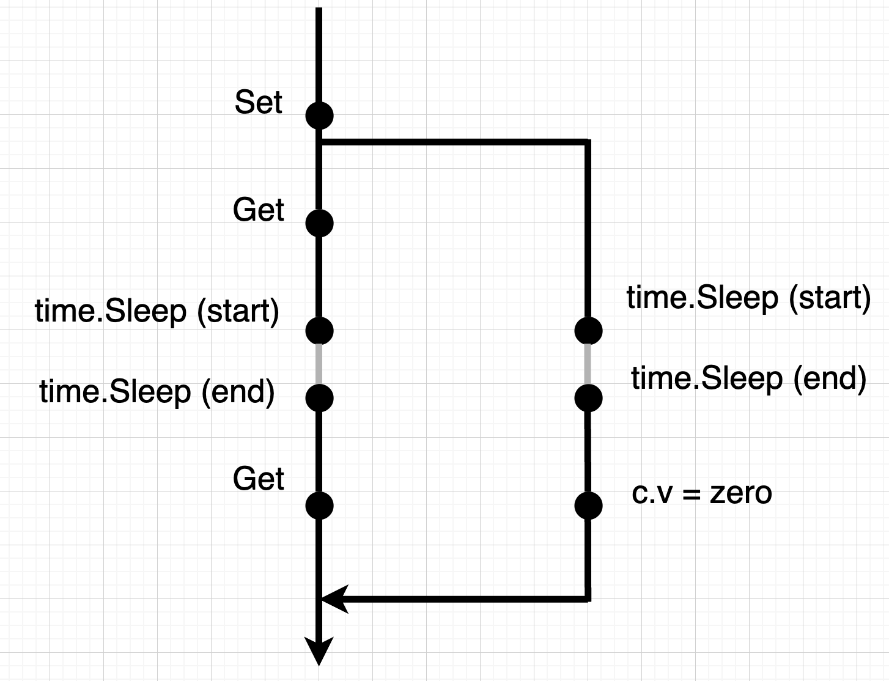

# 導入

Go1.24 が 2025 年 2 月にリリースされました 🎉🎉🎉

型エイリアスがジェネリクスに対応したり、map の実装が Swiss Table になったりと細かな改善が行われました！

今回はこの中から、実験的に導入された [testing/synctest](https://pkg.go.dev/testing/synctest) パッケージについて紹介したいと思います！

この記事では、testing/synctest で実装された 2 つの API を紹介しつつ、**GoDoc に記載されている具体的な仕様**についても触れたいと思っています。

# 実装された背景

そもそもなぜ、testing/synctest パッケージが導入されたのでしょうか？

**「並列なプログラムのテストを行うことは時間がかかり、flakly なテストになりがち」** という課題を解決するために実装された、というのが回答になります！

flaky なテストとは、実行時にランダムで落ちてしまうテストのことです。
この後の章で、実際に時間がかかるテストを書いてみたり、flaky なテストを再現してみようと思っています。

そして、実際に testing/synctest を導入することで、上記の課題が解決することも確かめてみたいと思います 🙌

# 実際に試してみる！

今回のコードで使用する Go のバージョンは 1.24.0 になります。

```bash
❯ go version
go version go1.24.0 darwin/arm64
```

また VSCode で実際に試してみたい方は、下記の設定を `setting.json` に追加してみてください 🙆‍♂️

```json
{
  "go.toolsEnvVars": {
    "GOEXPERIMENT": "synctest"
  }
}
```

## 実験 1: 簡単なキャッシュ

まずは下記のような簡単なキャッシュの例で考えてみます。

```go
package main

import (
	"time"
)

func NewCache[T any]() *Cache[T] {
	return &Cache[T]{}
}

type Cache[T any] struct {
	v       T
	ttl     time.Duration
	setTime time.Time
}

func (c *Cache[T]) Set(value T, ttl time.Duration) {
	c.v = value
	c.ttl = ttl
	c.setTime = time.Now()
}

func (c *Cache[T]) Get() T {
	if time.Since(c.setTime) >= c.ttl {
		var zero T
		return zero
	}
	return c.v
}
```

`Set` にキャッシュしたい値と TTL を渡します。`Get`は自身が呼ばれた時、TTL で指定した時間が経過していた場合はゼロ値を返し、経過する前の場合はキャッシュした値を返します。

あえて時間をかかるテストを書きたいので、TTL を 5 秒とし、テストを以下のように書いてみます。

```go
package main

import (
	"testing"
	"time"
)

func TestCache_Get(t *testing.T) {
	ttl := 5 * time.Second
	cache := NewCache[string]()
	cache.Set("cached item", ttl)

	if got := cache.Get(); got != "cached item" {
		t.Errorf("expected 'cached item'; got %v", got)
	}

	time.Sleep(ttl)

	if got := cache.Get(); got != "" {
		t.Errorf("expected ''; got %v", got)
	}
}
```

実行してみます！

```bash
❯ GOEXPERIMENT=synctest go test -run "TestCache_Get"
PASS
ok      github.com/k3forx/go124 5.229s
```

当たり前ですが、5 秒以上かかるテストになっています 😢

### `Run` 関数を使ってテスト時間を短くする

ここで登場するのが testing/synctest パッケージの `Run` 関数です！

**`Run` 関数で先ほどのテストコードを Wrap する**だけです。

```go
func TestCache_Get(t *testing.T) {
	synctest.Run(func() { // Run関数でテストをWrapする
		ttl := 5 * time.Second
		cache := NewCache[string]()
		cache.Set("cached item", ttl)

		if got := cache.Get(); got != "cached item" {
			t.Errorf("expected 'cached item'; got %v", got)
		}

		time.Sleep(ttl)

		if got := cache.Get(); got != "" {
			t.Errorf("expected ''; got %v", got)
		}
	})
}
```

実行してみます！

```bash
❯ GOEXPERIMENT=synctest go test -run "TestCache_Get"
PASS
ok      github.com/k3forx/go124 0.245s
```

実行時間が `5.229s` から `0.245s` に減りました！ 🎉🎉🎉

### `Run` 関数の GoDoc を見てみる！

さて、`Run` 関数はどのような挙動になっているのでしょうか？
（どういうロジックによって、テストの時間が短縮されるのでしょうか？）

GoDoc を見てみましょう 👀

```bash
❯ GOEXPERIMENT=synctest go doc testing/synctest.Run
package synctest // import "testing/synctest"

func Run(f func())
    Run executes f in a new goroutine.

    The new goroutine and any goroutines transitively started by it form an
    isolated "bubble". Run waits for all goroutines in the bubble to exit before
    returning.

    Goroutines in the bubble use a synthetic time implementation. The initial
    time is midnight UTC 2000-01-01.

    Time advances when every goroutine in the bubble is blocked. For example,
    a call to time.Sleep will block until all other goroutines are blocked and
    return after the bubble's clock has advanced. See Wait for the specific
    definition of blocked.

    If every goroutine is blocked and there are no timers scheduled, Run panics.

    Channels, time.Timers, and time.Tickers created within the bubble are
    associated with it. Operating on a bubbled channel, timer, or ticker from
    outside the bubble panics.
```

筆者が翻訳したものが以下になります。

1. `Run` は関数 `f` を新しいゴルーチンの中で実行する
1. 新しいゴルーチンとそれから間接的に開始されたゴルーチンは **_bubble_** を形成する
1. `Run` は bubble の中の**すべての**ゴルーチンが終了するまで待つ
1. bubble の中のゴルーチンは synthetic な時間実装を使う、初期時間は UTC の 2000-01-01
1. bubble の中の**すべての**ゴルーチンがブロックされたら時間が進む
1. すべてのゴルーチンがブロックされ、タイマーがスケジュールされていないなら、`Run`は panic する
1. bubble の中で作成されたチャネルや`time.Timers`、`time.Ticker`は bubble に紐づく
1. bubble の外から、bubble 内のチャネルや timer, ticker を操作すると panic になる

すべての仕様を確認することはせず、特に 3, 4, 5 の仕様に絞って動作を確認していきます!

**太字**で強調している部分もポイントになります 💡

---

まずは 4, 5 の仕様を確かめてみたいと思います！

下記のように `time.Sleep` を仕込んでみて、時刻を出力してみたいと思います。

```go
func TestCache_Get(t *testing.T) {
	synctest.Run(func() {
		fmt.Println(time.Now()) // 時刻を出力
		ttl := 5 * time.Second
		cache := NewCache[string]()
		cache.Set("cached item", ttl)

		if got := cache.Get(); got != "cached item" {
			t.Errorf("expected 'cached item'; got %v", got)
		}

		fmt.Println(time.Now()) // 時刻を出力
		time.Sleep(ttl)
		fmt.Println(time.Now()) // 時刻を出力

		if got := cache.Get(); got != "" {
			t.Errorf("expected ''; got %v", got)
		}
		fmt.Println(time.Now()) // 時刻を出力
	})
}
```

実行してみます。

```bash
❯ GOEXPERIMENT=synctest go test -run "TestCache_Get"
2000-01-01 09:00:00 +0900 JST m=+946640561.917543876
2000-01-01 09:00:00 +0900 JST m=+946640561.917543876
2000-01-01 09:00:05 +0900 JST m=+946640566.917543876
2000-01-01 09:00:05 +0900 JST m=+946640566.917543876
PASS
ok      github.com/k3forx/go124 0.251s
```

以下のことがわかりました 🔍

1. 2 回目までの時刻は `2000-01-01 09:00:00 (JST)` となっており、3 回目以降の時刻は `2000-01-01 09:00:05 (JST)` になっている
   - `Run` 関数の 4 番目の仕様である **「bubble の中のゴルーチンは synthetic な時間実装を使う、初期時間は UTC の 2000-01-01」** と一致
1. 1 回目と 2 回目の時刻、3 回目と 4 回目の時刻は同一時刻になっている
   - `Run` 関数の 5 番目の仕様である **「bubble の中のすべてのゴルーチンがブロックされたら時間が進む」** と一致

---

2 番目に関して少し補足します。

今回の場合、bubble の中で生成されるゴルーチンは 1 つになります。`time.Sleep(ttl)` によってそのゴルーチンがブロックされることにより、「bubble の中のすべてのゴルーチンがブロックされた」状態になります。

そのような状態になって **初めて** 時刻が進むようになります。なので、1 回目と 2 回目の時刻計測は同じ時刻になります。

`time.Sleep(ttl)` が終了した後はどうでしょうか？

その後、 **ゴルーチンがブロックされることはないので、時刻は進みません。** なので、3 回目と 4 回目の時刻計測が同じになります。

### ここで疑問 🤔

👦「別に TTL を 5 秒にしなくても、1 マイクロ秒にすればいいやん」

→ その通りです！今回の実装の場合 testing/synctest パッケージは不要です。

→ なぜなら **実装が直列で実行** され、TTL を短くすればそこまで長いテストにならないからです。

次はもう少し複雑な実装を考えてみます！

## 実験 2: 簡単なキャッシュ v2

では、`Set` を呼び出した際にゴルーチンを使って、キャッシュを expire する（ゼロ値に更新する）実装を考えてみます！

以下のようにコードを変更します。

```go
package main

import (
	"time"
)

func NewCache[T any]() *Cache[T] {
	return &Cache[T]{}
}

type Cache[T any] struct {
	v   T
	ttl time.Duration
}

func (c *Cache[T]) Set(value T, ttl time.Duration) {
	c.v = value
	c.ttl = ttl
	go func() {
		var zero T
		time.Sleep(ttl)
		c.v = zero
	}()
}

func (c *Cache[T]) Get() T {
	return c.v
}
```

テストコードは先ほどと全く同じものを使用し、100 回実行してみます。

```bash
❯ GOEXPERIMENT=synctest go test -run "TestCache_Get" -count=100
--- FAIL: TestCache_Get (0.00s)
    synctest_test.go:22: expected ''; got cached item
--- FAIL: TestCache_Get (0.00s)
    synctest_test.go:22: expected ''; got cached item
--- FAIL: TestCache_Get (0.00s)
    synctest_test.go:22: expected ''; got cached item
--- FAIL: TestCache_Get (0.00s)
    synctest_test.go:22: expected ''; got cached item
FAIL
exit status 1
FAIL    github.com/k3forx/go124 0.246s
```

4 回落ちました。flaky なテストになっているようです 😢

### なぜテストが落ちるのか？

原因は **「`Get`と`c.v = zero`のどちらが先に実行されるか分からない」** からです。

処理の流れを明確にするために、簡易的な図を用意してみました。
左がテストを実行するメインのゴルーチン、右が `Set` を呼び出した時に生成されるゴルーチンを表しています。つまり、このテストでは全部で **2 つ** のゴルーチンが存在しています。



処理の流れとしては、以下のようになっています。

1. メインのゴルーチンで `Set` が呼ばれる
1. サブのゴルーチンが作成され、 `time.Sleep(ttl)` でブロックされる
1. メインのゴルーチンで `Get` が呼ばれる
1. メインのゴルーチンで `time.Sleep(ttl)` が呼ばれ、ブロックされる
1. `Run` 関数により、時刻が進む
1. メインのゴルーチンとサブのゴルーチンのブロックが解除される
1. `Get` が呼ばれる？ `c.v = zero` が呼ばれる？

### `Wait` 関数を使って flaky なテストを直す

### `Wait` 関数の GoDoc を見てみる

### `Wait` 関数の挙動

## Go クイズ！

# まとめ

いかがだったでしょうか？ `Run` 関数の挙動が少し分かったのではないでしょうか 🙌
